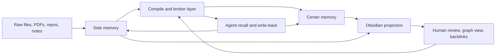

# Obsidian Visualization Refinement

This document refines the `second-brain` architecture after reviewing [kytmanov/obsidian-llm-wiki-local](https://github.com/kytmanov/obsidian-llm-wiki-local).

The useful idea is not "make Obsidian the knowledge engine." The useful idea is "give the knowledge engine a clean, inspectable, graph-friendly projection that humans can browse and review."

For this component, Obsidian should be treated as:

- a human-facing projection layer
- a review surface for drafts, conflicts, and synthesis
- a graph visualization surface for center knowledge

It should not be treated as:

- the canonical storage engine
- the primary retrieval engine
- the main runtime ledger
- a replacement for hybrid search, provenance indexes, or brokered recall

## Executive Position

`obsidian-llm-wiki-local` gets several important things right:

- clear separation between raw inputs and published wiki pages
- a draft to approve or reject lifecycle
- alias-aware wikilinks
- broken-link repair and stub creation
- generated index pages that make the graph understandable

For `second-brain`, those ideas should be imported, but into a stronger architecture:

- `second-brain` remains canonical
- markdown plus derived indexes remain the core contract
- center memory remains bounded and typed
- side memory remains large and evidence-heavy
- Obsidian becomes a generated view over center memory plus a thin layer of side summaries

That is the right improvement over `obsidian-llm-wiki-local` for a medium-sized paper corpus and long-running modeling work.

## What The Reference Project Gets Right

### 1. Raw And Published Knowledge Are Different Things

The reference project uses a clean split:

- `raw/` for incoming notes
- `wiki/` for published pages
- `wiki/.drafts/` for reviewable compiled pages

That is correct. Raw files are evidence. Published pages are compiled knowledge.

For `second-brain`, this maps well onto the center / side model:

- side memory holds sources, chunks, indexes, logs, and queue state
- center memory holds bounded knowledge objects
- the Obsidian vault should mostly show center memory, not the entire side store

### 2. Draft / Publish Is A Real Architectural Boundary

The best idea in the reference project is that compiled output does not immediately become trusted center knowledge.

That is important for this component because the agent will be:

- compiling from noisy PDFs
- reconciling contradictory literature
- generating project syntheses under changing experimental conditions

Center memory should therefore support an explicit lifecycle such as:

- `candidate`
- `draft`
- `published`
- `conflicted`
- `stale`
- `superseded`

Obsidian is a good surface for humans and coding agents to inspect those states.

### 3. Alias Normalization Prevents Graph Fragmentation

The reference project uses alias tables and rewrites `[[Alias]]` to `[[Canonical|Alias]]`.

That is a strong idea and should be adopted directly.

In research workflows, the same concept appears under many surface forms:

- "Chain of Thought" vs "CoT"
- "In-context learning" vs "ICL"
- "Maximum mean discrepancy" vs "MMD"

Without canonical alias handling, the graph becomes fragmented, retrieval weakens, and synthesis pages start duplicating ideas.

### 4. Broken-Link Repair And Stub Creation Are Useful

The reference project treats unresolved links as maintainable state, not just lint noise.

That is the right posture.

For `second-brain`, broken references should be able to create:

- draft concept stubs
- draft paper stubs
- draft method stubs
- unresolved conflict queues

This gives the system a way to acknowledge missing structure without polluting the published center.

### 5. Generated Index Pages Matter

The reference project generates an index page so Obsidian can expose useful graph and backlink structure.

That should be extended here.

For `second-brain`, hub pages should be generated by object type and by project, not only as a flat concept index.

## What Should Not Be Copied

### 1. Do Not Make Obsidian The Canonical Database

This component already has the better contract:

- canonical markdown objects
- derived search and graph indexes
- a runtime ledger
- brokered retrieval

The vault should be rebuildable at any time from canonical objects plus projection rules.

### 2. Do Not Flatten Everything Into Concept Pages

The reference project is concept-centric. That is reasonable for personal notes, but not enough for modeling work.

This system needs first-class pages for:

- projects
- papers
- concepts
- claims
- experiments
- syntheses
- open questions
- methods

If everything becomes only a concept note, the graph loses operational meaning.

### 3. Do Not Use The Vault As The Main Retrieval Path

`obsidian-llm-wiki-local` is intentionally simple and can avoid vectors for smaller note collections.

That is not the right trade-off here.

This component still needs:

- hybrid retrieval over side memory
- provenance-aware evidence recall
- brokered recall packets that mix center objects with side evidence

The vault is for inspection and navigation. The broker remains the retrieval authority.

### 4. Do Not Export Raw Chunks As Graph Nodes

If every chunk becomes a page, the graph becomes unreadable and the center gets overwhelmed.

The vault should expose:

- center pages directly
- source summary pages selectively
- evidence references inside pages

It should not expose:

- chunk-level pages by default
- raw OCR fragments
- every retrieval candidate as a visible node

## Recommended Role Of Obsidian In `second-brain`

### Core Rule

Obsidian should be an optional generated projection of the knowledge engine.

The projection should exist to help with:

- human review
- coding-agent maintenance
- graph browsing
- backlink navigation
- conflict inspection
- synthesis reading

It should not be required for the engine to function.

### Projection Rule

Only export graph-worthy knowledge objects.

Export these object types by default:

- `projects`
- `papers`
- `concepts`
- `claims`
- `experiments`
- `syntheses`
- `questions`

Export these side objects selectively:

- source summary pages
- unresolved conflict pages
- stub pages

Do not export these by default:

- chunks
- raw ingestion artifacts
- low-level pipeline logs
- full retrieval traces

## Recommended Vault Shape

Recommended generated vault:

```text
$SECOND_BRAIN_HOME/views/obsidian/
  Home.md
  Index/
    By Project.md
    By Paper.md
    By Concept.md
    By Experiment.md
    Open Questions.md
    Conflicts.md
  Projects/
  Papers/
  Concepts/
  Claims/
  Experiments/
  Syntheses/
  Questions/
  Sources/
  .drafts/
  .meta/
```

Notes:

- `views/obsidian/` is generated and rebuildable
- `.drafts/` is reviewable but not part of the published center
- `.meta/` can hold generated maps, export stamps, and projection state
- `Sources/` contains source summaries, not raw files

## Center / Side / Projection Model



Interpretation:

- side memory is where evidence lives
- center memory is where durable research knowledge lives
- the Obsidian vault is a projection of center memory plus a narrow slice of side context

## Page Design Rules

Each exported page should carry stable, machine-usable frontmatter.

Recommended required fields:

- `id`
- `type`
- `status`
- `title`
- `aliases`
- `project_ids`
- `paper_ids`
- `source_ids`
- `updated_at`
- `confidence`
- `conflict_state`

Recommended type-specific fields:

- papers: `authors`, `year`, `venue`, `doi`, `arxiv_id`
- experiments: `run_id`, `metric_summary`, `dataset`, `model_family`
- claims: `supports`, `contradicts`, `refines`
- syntheses: `scope`, `question`, `decision_state`

Body structure should be consistent.

Example page outline:

```markdown
---
id: paper:attention-is-all-you-need
type: paper
status: published
title: Attention Is All You Need
aliases:
  - Transformer paper
project_ids:
  - project:seq-modeling
source_ids:
  - source:arxiv-1706-03762
updated_at: 2026-04-20
confidence: 0.93
conflict_state: none
---

# Attention Is All You Need

## Summary

## Key Claims

## Relevance To Current Projects

## Linked Concepts

## Evidence

## Open Questions

## Related Experiments
```

## Link Rules

The projection should use canonical wikilinks:

- `[[Canonical]]` when surface form already matches the canonical title
- `[[Canonical|Alias]]` when the written term is an alias

Recommended link policy:

- project pages link to papers, experiments, syntheses, and open questions
- paper pages link to claims, concepts, methods, and experiments that cite or test them
- experiment pages link to papers they were motivated by and claims they support or weaken
- synthesis pages link to both literature and experiment outcomes
- source summary pages link upstream to paper pages and downstream to raw source ids

This is a better graph than a concept-only wiki because it exposes operational reasoning, not just topic adjacency.

## Drafts, Publish, And Review

The reference project is right that draft review should be first-class.

For `second-brain`, recommended rules are:

- newly compiled or materially changed center pages land in `.drafts/`
- published pages remain stable until approved replacement is ready
- conflicts should be visible in draft and published states
- approval, rejection, and notes should be stored in canonical state, not only in the vault

Recommended review actions:

- approve
- reject with feedback
- mark conflicted
- mark stale
- merge into another canonical page
- create a stub from unresolved reference

Obsidian is useful here because it makes diffs, backlinks, and related pages easy to inspect.

## Stub Strategy

Stub creation should be more selective than "every missing link becomes a page."

Recommended rule:

- create a draft stub when a missing entity is referenced by a published center page or by at least two independent drafts
- do not publish a stub automatically
- attach backlinks and provenance so the missing concept is actionable

Recommended stub types:

- concept stub
- paper stub
- method stub
- dataset stub

This keeps the graph useful without letting unresolved noise dominate it.

## Source Summary Pages

Source summaries are the right bridge between side memory and center memory.

Each exported source page should summarize:

- what the source is
- what center objects were compiled from it
- key sections or page spans
- extraction confidence
- unresolved issues

But the source page should not become a substitute for full provenance indexes.

The vault should show source summaries because they are graph-useful. The actual evidence system still lives in side memory and retrieval indexes.

## Improvement Over `wiki/index.md`

The reference project uses a generated index page as a routing surface.

For this component, hub pages should be richer:

- `Home.md` for the top-level view
- typed indexes by project, paper, concept, experiment, and synthesis
- "open questions" and "conflicts" hubs for maintenance work
- per-project dashboards linking current literature, active experiments, and blocked assumptions

This is the right improvement because the real work is not "what is concept X" but "what literature and evidence should drive the next modeling step for project Y."

## Human And Agent Interaction Model

The Obsidian vault should help both humans and coding agents.

Human uses:

- browse graph and backlinks
- inspect conflicts
- review draft pages
- read syntheses and project dashboards

Coding-agent uses:

- create or update projection pages
- repair aliases and broken links
- generate stubs and conflict pages
- surface review queues
- validate that published graph pages stay consistent with canonical state

This should be explicit in the operator surface.

## Recommended CLI Surface

Add commands such as:

- `sb export obsidian`
- `sb export obsidian --project <id>`
- `sb obsidian lint`
- `sb obsidian repair-links`
- `sb obsidian rebuild-index`
- `sb obsidian review-queue`

Recommended contract:

- export is deterministic
- export never mutates canonical knowledge directly
- review actions write back into canonical state, then projection is refreshed

## Recommended Configuration

For the proof-of-concept, prefer clarity and graph quality over minimalism.

Suggested initial config:

```toml
[obsidian]
enabled = true
export_root = "$SECOND_BRAIN_HOME/views/obsidian"
export_drafts = true
export_source_summaries = true
export_chunks = false
export_conflicts = true
export_open_questions = true
normalize_alias_links = true
generate_hub_pages = true
max_related_links_per_page = 30
stub_requires_published_backlink = true
stub_min_backlinks = 2
```

Rationale:

- `export_chunks = false` protects graph readability
- source summaries are worth exporting because they bridge center and side
- hub pages make the vault useful immediately
- alias normalization must be on by default

## E2E Tests For The Obsidian Projection

This layer needs its own end-to-end coverage.

### 1. Export Builds A Clean Vault

Fixture:

- two papers
- one project
- two experiments
- one synthesis

Expected result:

- correct pages are exported
- no chunk pages are created
- all links resolve
- hub pages contain expected entries

### 2. Alias Normalization Keeps Graph Canonical

Fixture:

- concept with aliases such as `CoT` and `Chain of Thought`
- experiment and synthesis pages refer to both forms

Expected result:

- graph contains one canonical target
- aliases appear as display text only
- link repair is idempotent

### 3. Draft To Publish Works

Fixture:

- changed paper compilation generates a draft
- reviewer approves replacement

Expected result:

- published page is updated
- prior page is superseded correctly
- vault refresh keeps backlinks intact

### 4. Broken References Create Actionable Stubs

Fixture:

- a synthesis page references a missing dataset or method

Expected result:

- draft stub is created
- stub appears in review queue and conflict hubs
- stub is not auto-published

### 5. Experiment Pages Connect Literature To Outcomes

Fixture:

- experiment cites paper A, weakens claim B, and opens question C

Expected result:

- project page shows the experiment
- paper backlinks show the experiment
- open-question hub shows the unresolved issue

### 6. Projection Rebuild Is Deterministic

Fixture:

- same canonical center and side objects exported twice

Expected result:

- no spurious file churn
- no unstable ordering
- identical page content except timestamps when intentionally updated

## Final Design Choice

The right refinement is:

- keep `second-brain` as the real knowledge engine
- add an Obsidian-compatible projection for graph inspection and review
- borrow draft / publish, aliases, stub creation, and generated hubs
- reject the idea that the Obsidian vault should replace hybrid retrieval or canonical storage

This gives the system the best part of the LLM wiki pattern without collapsing the architecture into a note-taking app.
