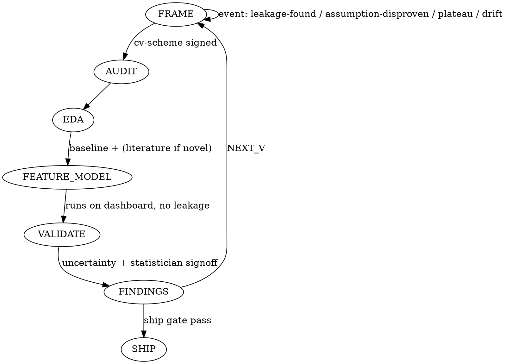

# Data Science Iteration Skill — Implementation Plan

> **For agentic workers:** REQUIRED SUB-SKILL: Use `superpowers:subagent-driven-development` (recommended) or `superpowers:executing-plans` to implement this plan task-by-task. Steps use checkbox (`- [ ]`) syntax for tracking.

**Spec:** `docs/specs/2026-04-12-data-science-iteration-design.md`

**Goal:** Author the standalone `data-science-iteration` skill — orchestrator SKILL.md, 6 personas, 11 playbooks, 5 templates, 5 checklists, static dashboard, slash command — installed at `~/.claude/skills/data-science-iteration/`.

**Architecture:** Markdown-driven orchestrator that owns a `vN`-style iteration loop with gated phases, persona-backed sign-offs, and a bundled static dashboard (vanilla JS + uPlot, served by a transient local `python -m http.server`). Disproven hypotheses are first-class artifacts. Live leaderboard reflects every modeled run.

**Tech Stack:** Markdown (skill content), JSON Schema (state + leaderboard contracts), vanilla HTML/CSS/JS + uPlot (dashboard, < 80 kB), Python stdlib (`http.server`, `socket`) for the server helper, `pytest` + `jsonschema` for the code-testable slices, `bats-core` or shell for the leakage-grep checklist test.

**Working directory:** author files under `~/.claude/skills/data-science-iteration/`. Use a staging repo at `~/Developer/claude-code-agent/skills-staging/data-science-iteration/` if the user prefers git tracking; otherwise author in place and commit via the dotfiles repo they maintain separately. **Default:** author directly at `~/.claude/skills/data-science-iteration/` and `git init` inside it for history.

**Testing approach:**
- Markdown skill files: verified by a structural checklist test (`scripts/verify_skill_files.py`) — every required file exists, has valid frontmatter where applicable, cross-references resolve.
- JSON schemas: validated with `jsonschema` against hand-crafted fixtures.
- Dashboard JS: tested headless with `vitest` + `jsdom` (fetches fixture `leaderboard.json`, asserts DOM content).
- Leakage-grep patterns: tested with shell fixtures (known-bad and known-good Python snippets).
- Server helper: unit-tested for free-port selection and clean teardown.

---

## File Structure

```
~/.claude/skills/data-science-iteration/
├── SKILL.md                                # Task 3
├── iron-laws.md                            # Task 4
├── loop-state-machine.md                   # Task 5
├── workspace-layout.md                     # Task 6
├── dashboard-spec.md                       # Task 6
├── personas/
│   ├── skeptic.md                          # Task 7
│   ├── validation-auditor.md               # Task 7
│   ├── statistician.md                     # Task 7
│   ├── explorer.md                         # Task 7
│   ├── literature-scout.md                 # Task 7
│   └── engineer.md                         # Task 7
├── playbooks/
│   ├── phase-frame.md                      # Task 8
│   ├── phase-audit.md                      # Task 8
│   ├── phase-eda.md                        # Task 8
│   ├── phase-feature-model.md              # Task 8
│   ├── phase-validate.md                   # Task 8
│   ├── phase-findings.md                   # Task 8
│   ├── event-leakage-found.md              # Task 9
│   ├── event-assumption-disproven.md       # Task 9
│   ├── event-metric-plateau.md             # Task 9
│   ├── event-cv-holdout-drift.md           # Task 9
│   └── event-novel-modeling-flag.md        # Task 9
├── templates/
│   ├── plan-vN.md                          # Task 10
│   ├── finding-card.md                     # Task 10
│   ├── disproven-card.md                   # Task 10
│   ├── literature-memo.md                  # Task 10
│   ├── state.schema.json                   # Task 11
│   └── leaderboard.schema.json             # Task 11
├── checklists/
│   ├── leakage-audit.md                    # Task 12
│   ├── cv-scheme-decision.md               # Task 12
│   ├── assumption-tests.md                 # Task 12
│   ├── reproducibility.md                  # Task 12
│   └── ship-gate.md                        # Task 12
├── dashboard-template/
│   ├── index.html                          # Task 13
│   ├── assets/styles.css                   # Task 13
│   ├── assets/app.js                       # Task 14
│   ├── assets/charts.js                    # Task 14
│   └── assets/vendor/uPlot.min.js          # Task 14
├── server/
│   └── serve_dashboard.py                  # Task 15
├── slash/
│   └── ds.md                               # Task 16
├── scripts/
│   ├── verify_skill_files.py               # Task 2
│   ├── test_leakage_patterns.sh            # Task 12
│   └── fixtures/                           # fixtures for tests
└── tests/
    ├── test_schemas.py                     # Task 11
    ├── test_server.py                      # Task 15
    └── dashboard/                          # vitest project — Task 14
```

---

### Task 1: Scaffold skill directory and initialize git

**Files:**
- Create: `~/.claude/skills/data-science-iteration/` (tree of empty dirs)

- [ ] **Step 1: Create directory tree**

```bash
SK=~/.claude/skills/data-science-iteration
mkdir -p "$SK"/{personas,playbooks,templates,checklists,dashboard-template/assets/vendor,server,slash,scripts/fixtures,tests/dashboard}
```

- [ ] **Step 2: Init git and add .gitignore**

```bash
cd "$SK" && git init -q
cat > .gitignore <<'EOF'
__pycache__/
*.pyc
.pytest_cache/
tests/dashboard/node_modules/
tests/dashboard/coverage/
EOF
```

- [ ] **Step 3: Commit**

```bash
cd "$SK" && git add -A && git commit -q -m "chore: scaffold data-science-iteration skill tree"
```

---

### Task 2: Skill file verifier (TDD harness for markdown content)

**Files:**
- Create: `scripts/verify_skill_files.py`
- Create: `tests/test_verify_skill_files.py`

- [ ] **Step 1: Write failing test**

File: `tests/test_verify_skill_files.py`
```python
import subprocess, sys, pathlib
SK = pathlib.Path(__file__).resolve().parents[1]

def test_verifier_reports_missing_core_files():
    r = subprocess.run([sys.executable, str(SK/"scripts/verify_skill_files.py")],
                       capture_output=True, text=True)
    # Before any SKILL.md exists, verifier must fail with an explicit listing
    assert r.returncode != 0
    assert "SKILL.md" in r.stdout + r.stderr
```

- [ ] **Step 2: Run test to confirm failure**

```bash
cd ~/.claude/skills/data-science-iteration && python -m pytest tests/test_verify_skill_files.py -v
```
Expected: FAIL — `verify_skill_files.py` does not exist.

- [ ] **Step 3: Implement verifier**

File: `scripts/verify_skill_files.py`
```python
#!/usr/bin/env python3
"""Verify required skill files exist and have minimal structure."""
from __future__ import annotations
import pathlib, re, sys, yaml

ROOT = pathlib.Path(__file__).resolve().parents[1]

REQUIRED = [
    "SKILL.md", "iron-laws.md", "loop-state-machine.md",
    "workspace-layout.md", "dashboard-spec.md",
    "personas/skeptic.md", "personas/validation-auditor.md",
    "personas/statistician.md", "personas/explorer.md",
    "personas/literature-scout.md", "personas/engineer.md",
    "playbooks/phase-frame.md", "playbooks/phase-audit.md",
    "playbooks/phase-eda.md", "playbooks/phase-feature-model.md",
    "playbooks/phase-validate.md", "playbooks/phase-findings.md",
    "playbooks/event-leakage-found.md",
    "playbooks/event-assumption-disproven.md",
    "playbooks/event-metric-plateau.md",
    "playbooks/event-cv-holdout-drift.md",
    "playbooks/event-novel-modeling-flag.md",
    "templates/plan-vN.md", "templates/finding-card.md",
    "templates/disproven-card.md", "templates/literature-memo.md",
    "templates/state.schema.json", "templates/leaderboard.schema.json",
    "checklists/leakage-audit.md", "checklists/cv-scheme-decision.md",
    "checklists/assumption-tests.md", "checklists/reproducibility.md",
    "checklists/ship-gate.md",
    "dashboard-template/index.html",
    "dashboard-template/assets/styles.css",
    "dashboard-template/assets/app.js",
    "dashboard-template/assets/charts.js",
    "server/serve_dashboard.py",
    "slash/ds.md",
]

FRONTMATTER = re.compile(r"^---\n(.*?)\n---", re.DOTALL)

def check_skill_frontmatter(p: pathlib.Path) -> list[str]:
    text = p.read_text()
    m = FRONTMATTER.match(text)
    if not m:
        return [f"{p.name}: missing YAML frontmatter"]
    try:
        fm = yaml.safe_load(m.group(1))
    except yaml.YAMLError as e:
        return [f"{p.name}: invalid YAML frontmatter ({e})"]
    errs = []
    for k in ("name", "description"):
        if not fm.get(k):
            errs.append(f"{p.name}: frontmatter missing '{k}'")
    return errs

def main() -> int:
    errors: list[str] = []
    for rel in REQUIRED:
        p = ROOT / rel
        if not p.exists():
            errors.append(f"MISSING: {rel}")
    skill_md = ROOT / "SKILL.md"
    if skill_md.exists():
        errors.extend(check_skill_frontmatter(skill_md))
    if errors:
        print("\n".join(errors))
        return 1
    print("OK: all required files present")
    return 0

if __name__ == "__main__":
    sys.exit(main())
```

- [ ] **Step 4: Run test to confirm failure message is now correct**

```bash
cd ~/.claude/skills/data-science-iteration && python -m pytest tests/test_verify_skill_files.py -v
```
Expected: PASS (the verifier runs, returns non-zero, mentions `SKILL.md`).

- [ ] **Step 5: Commit**

```bash
cd ~/.claude/skills/data-science-iteration && git add scripts/verify_skill_files.py tests/test_verify_skill_files.py && git commit -q -m "test: add skill-file verifier harness"
```

---

### Task 3: Author `SKILL.md` (orchestrator)

**Files:**
- Create: `SKILL.md`

- [ ] **Step 1: Write SKILL.md**

File: `SKILL.md`
````markdown
---
name: data-science-iteration
description: Use when working from a dataset or model-with-data goal; runs a suspicious-yet-creative iterative loop (v1 → v2 → v3 …) with gated phases, persona sign-offs, locked-holdout discipline, literature review, disproven-as-artifact, and a live leaderboard dashboard.
---

# Data Science Iteration

## The Iron Law

```
NO PHASE TRANSITION WITHOUT A SIGNED GATE.
NO MODELED RUN OFF THE DASHBOARD.
THE LOCKED HOLDOUT IS READ EXACTLY ONCE, AT SHIP.
```

See [iron-laws.md](iron-laws.md) for the full list and enforcement mechanics.

## When to Use

- Starting a modeling project from data or a loose goal.
- When discipline matters more than speed (research, high-stakes decisions, reproducible science).
- When the decision/metric is roughly known. If it isn't, brainstorm the framing first with the user, then enter this skill.

## When NOT to Use

- Production MLOps, deploy, drift monitoring.
- AutoML bandits.
- Pure engineering tasks that happen to touch data.

## Entry flow

1. Ask four framing questions, one at a time:
   1. What decision does this model support? (grounds metric)
   2. Data unit/grain and time structure? (grounds CV scheme)
   3. Hard success threshold? (grounds ship gate)
   4. Track: notebook or script?
2. Create `ds-workspace/` using [workspace-layout.md](workspace-layout.md).
3. Seed dashboard from `dashboard-template/`. Start server via `server/serve_dashboard.py`. Print URL.
4. Draft `plans/v1.md` from `templates/plan-vN.md`.
5. Run Skeptic + Validation Auditor gate on the draft.
6. Enter loop: see [loop-state-machine.md](loop-state-machine.md).

## Loop (summary)

Phases per vN: `FRAME → AUDIT → EDA → FEATURE_MODEL → VALIDATE → FINDINGS → (SHIP | NEXT_V)`.
Events can abort and open vN+1 mid-phase — see [loop-state-machine.md](loop-state-machine.md).

## Personas and who gates what

See [personas/](personas/). Quick map:

| Gate | Required sign-off |
|---|---|
| FRAME exit | Skeptic + Validation Auditor |
| FEATURE_MODEL entry | baseline recorded + literature memo if novel-modeling-flag |
| VALIDATE exit | Statistician + Validation Auditor |
| FINDINGS exit | every hypothesis resolved to finding-card or disproven-card |
| SHIP | Skeptic + Auditor + Statistician + Engineer + ship-gate checklist |

## Parallel subagent dispatch at gates

For heavy reviews (Literature Scout full memo, multi-file leakage grep, reproducibility re-run), dispatch each persona as a parallel subagent. Each returns its audit artifact; orchestrator collects, then decides gate outcome.

## Dashboard contract

Every modeled run must appear in `ds-workspace/dashboard/data/leaderboard.json` before its phase can exit. See [dashboard-spec.md](dashboard-spec.md).

## User commands during loop

- `status` — print current phase, blockers, leaderboard top-3.
- `ship` — open ship-gate sequence.
- `abort` — tear down; dashboard preserved.
- `force v+1 <reason>` — close vN early and open v(N+1).
- `dig <hypothesis>` — branch investigation without leaving current vN.

## Red Flags (stop and check)

| Thought | Reality |
|---|---|
| "Let me just peek at the holdout" | Iron Law #1. Any unlogged read invalidates the run. |
| "CV scheme is obvious, skip the audit" | Iron Law #2. Time/group/stratified choice is signed before features. |
| "Fit the scaler on all data for convenience" | Iron Law #3. Fit inside folds only. |
| "Point estimate is fine" | Iron Law #4. CI or CV-std required. |
| "Baseline is boring, go straight to GBM" | Iron Law #5. Baseline first, always. |
| "This hypothesis didn't pan out, move on" | Iron Law #6. Write the disproven-card. |
| "This model is novel but I know the space" | Iron Law #7. Literature Scout memo committed first. |
| "t-test, run it" | Iron Law #8. Assumption tests first. |
| "Works on my machine" | Iron Law #9. Seed + env + data hash logged. |
| "Quick fit in the notebook cell" | Iron Law #10. Notebooks call `src/` only. |
| "Didn't log that run" | Iron Law #11. Not on dashboard = doesn't exist. |

## Compatibility (optional)

This skill is standalone. It is compatible with but does not require: `superpowers:brainstorming`, `python-patterns`, `python-testing`, `eval-harness`, `exa-search`, `deep-research`, `continuous-learning`. See spec §9.
````

- [ ] **Step 2: Re-run verifier (SKILL.md now exists; frontmatter must be valid)**

```bash
cd ~/.claude/skills/data-science-iteration && python scripts/verify_skill_files.py
```
Expected: output lists remaining MISSING files but NO frontmatter error for SKILL.md.

- [ ] **Step 3: Commit**

```bash
git add SKILL.md && git commit -q -m "feat: author orchestrator SKILL.md"
```

---

### Task 4: Author `iron-laws.md`

**Files:**
- Create: `iron-laws.md`

- [ ] **Step 1: Write file with the 11 laws and their enforcement mechanisms (verbatim from spec §7)**

File: `iron-laws.md`
```markdown
# Iron Laws

Each law is enforced by a concrete mechanism. Rules without mechanisms are wishes.

## #1 Locked holdout exists before any modeling
**Mechanism:** `ds-workspace/holdout/HOLDOUT_LOCK.txt` contains sha256 + lock timestamp + "DO NOT READ UNTIL SHIP". Orchestrator maintains `state.holdout_reads` counter. VALIDATE phase refuses to read `holdout/` outside ship gate. Any unlogged read logged to `audits/vN-repro.md` and the run is marked `invalidated` on the dashboard.

## #2 CV scheme chosen before features
**Mechanism:** FRAME phase cannot exit until `audits/vN-cv-scheme.md` is signed by Validation Auditor. AUDIT/EDA/FEATURE_MODEL refuse to start without that signed file. Scheme decision uses [checklists/cv-scheme-decision.md](checklists/cv-scheme-decision.md).

## #3 No target-dependent fit on full data
**Mechanism:** Validation Auditor runs [checklists/leakage-audit.md](checklists/leakage-audit.md) — a grep playbook over `ds-workspace/src/` for known leak patterns (fit_transform before split, target encoding without CV, scaler fit on concat, `.fit(X_train)` outside pipeline). Hits fire the `leakage-found` event.

## #4 Every metric reported with uncertainty
**Mechanism:** Statistician rejects `runs/vN/metrics.json` lacking `cv_std` or `cv_ci95`. VALIDATE cannot sign off until uncertainty is present. Single-seed point estimates are rejected.

## #5 Baseline before complexity
**Mechanism:** FEATURE_MODEL entry checks `runs/*/metrics.json` for an entry tagged `baseline: true`. Absent → refuses non-baseline fits. Every later model reports `lift_vs_baseline` (not absolute score) on the leaderboard.

## #6 Disproven hypotheses are artifacts
**Mechanism:** FINDINGS exit requires every hypothesis id from `plans/vN.md` to resolve to a `findings/vN-fNNN.md` OR `disproven/vN-dNNN.md`. Orchestrator lists unresolved hypotheses and refuses exit.

## #7 Literature review before novel modeling
**Mechanism:** `novel-modeling-flag` fires when the proposed model family is outside `{linear, tree, gbm}`. Flag requires `literature/vN-memo.md` present before FEATURE_MODEL entry. Memo produced via [personas/literature-scout.md](personas/literature-scout.md).

## #8 Assumption tests before parametric stats
**Mechanism:** Statistician's [checklists/assumption-tests.md](checklists/assumption-tests.md) gates any parametric inference in findings. Failed assumptions block the inference (require non-parametric alternative or remediation).

## #9 Reproducibility: seed, env, data hash
**Mechanism:** Engineer checks that every `runs/vN/` contains `seed.txt`, `env.lock`, `data.sha256`. Re-runs one random CV fold from the seed/env; compares metrics within numerical tolerance. Mismatch = Engineer block. Details: [checklists/reproducibility.md](checklists/reproducibility.md).

## #10 Notebooks call `src/` only
**Mechanism:** Validation Auditor greps `nb/*.ipynb` cell sources for `class `, `def fit`, `sklearn.*\.fit(`, etc. Definitions in notebook cells are violations that block FINDINGS.

## #11 Every modeled run appears on the dashboard
**Mechanism:** FEATURE_MODEL and VALIDATE exits refuse if the run is not present in `ds-workspace/dashboard/data/leaderboard.json`. Writer contract in [dashboard-spec.md](dashboard-spec.md) is mandatory, not advisory.

---

## Enforcement pattern (common to all rules)

Phase transitions happen only when required files exist and have been signed. Persona output IS the signature. A gate is a checklist file; a sign-off is the filesystem-visible write of that checklist with the persona name filled in. This is mechanical, not advisory.
```

- [ ] **Step 2: Re-run verifier**

```bash
python scripts/verify_skill_files.py
```
Expected: MISSING count drops by one; SKILL.md and iron-laws.md no longer listed.

- [ ] **Step 3: Commit**

```bash
git add iron-laws.md && git commit -q -m "feat: author iron-laws.md with 11 mechanisms"
```

---

### Task 5: Author `loop-state-machine.md`

**Files:**
- Create: `loop-state-machine.md`

- [ ] **Step 1: Write file (spec §3, verbatim-by-intent with added DOT graph)**

File: `loop-state-machine.md`
````markdown
# Loop State Machine

## Phases within an iteration vN

```
FRAME → AUDIT → EDA → FEATURE_MODEL → VALIDATE → FINDINGS → (SHIP | NEXT_V)
```

## Phase entry gates

| Phase | Gate file that must exist and be signed |
|---|---|
| FRAME | `plans/vN.md` draft + `data-contract.md` |
| AUDIT | `audits/vN-cv-scheme.md` signed by Validation Auditor |
| EDA | `plans/vN.md` + Explorer persona prompt loaded |
| FEATURE_MODEL | a run tagged `baseline: true` in `runs/*/metrics.json`; if `novel-modeling-flag`, also `literature/vN-memo.md` |
| VALIDATE | no leakage patterns active; CV results with uncertainty present |
| FINDINGS | every hypothesis id resolved to finding-card OR disproven-card |

## Cross-cutting events

Events fire any time, abort the current phase, and open v(N+1).

| Event | Trigger | Response |
|---|---|---|
| `leakage-found` | Validation Auditor grep or manual finding | Mark affected runs `invalidated` on dashboard; open v(N+1) with leakage remediation as first hypothesis |
| `assumption-disproven` | Statistician or Skeptic shows framing assumption is false | File disproven-card, update `data-contract.md`, open v(N+1) |
| `metric-plateau` | Two consecutive vN with no stat-significant CV improvement | Trigger Full Literature Scout for v(N+1) |
| `cv-holdout-drift` | Gap between CV and holdout at ship gate exceeds predicted interval | Do NOT ship; open v(N+1) investigating drift source |
| `novel-modeling-flag` | Proposed model outside {linear, tree, gbm} | Require `literature/vN-memo.md` before FEATURE_MODEL |

## Stop criteria (run ends)

Run ends when ALL of:

1. User says `ship`, AND
2. All Skeptic / Validation Auditor CRITICAL blockers cleared, AND
3. CV metric meets pre-declared target, AND
4. Locked holdout evaluated exactly once → final report generated.

OR diminishing-returns gate: 3 consecutive vN with no stat-significant CV improvement → orchestrator proposes `ship` or `pivot`.

OR user says `abort`.

## State diagram


````

- [ ] **Step 2: Verifier check & commit**

```bash
python scripts/verify_skill_files.py
git add loop-state-machine.md && git commit -q -m "feat: loop state machine"
```

---

### Task 6: Author `workspace-layout.md` and `dashboard-spec.md`

**Files:**
- Create: `workspace-layout.md`
- Create: `dashboard-spec.md`

- [ ] **Step 1: Write `workspace-layout.md`**

File: `workspace-layout.md`
```markdown
# Workspace Layout (`ds-workspace/`)

Per-project, created at run start in the current project root. Never auto-pruned.

```
<project-root>/ds-workspace/
├── state.json                  # see templates/state.schema.json
├── data-contract.md
├── holdout/
│   ├── HOLDOUT_LOCK.txt        # sha256 + lock timestamp + DO NOT READ notice
│   └── holdout.parquet
├── plans/vN.md
├── findings/vN-fNNN.md
├── disproven/vN-dNNN.md        # first-class learning artifacts
├── literature/vN-memo.md
├── audits/
│   ├── vN-skeptic.md
│   ├── vN-leakage.md
│   ├── vN-cv-scheme.md
│   ├── vN-assumptions.md
│   ├── vN-repro.md
│   └── vN-ship-gate.md
├── runs/vN/
│   ├── metrics.json            # CV mean/std, CI, lift_vs_baseline, baseline flag
│   ├── env.lock
│   ├── seed.txt
│   ├── data.sha256
│   └── plots/
├── nb/                          # notebook track
│   └── vN_*.ipynb               # must only call src/
├── src/                         # library code
│   └── data/ features/ models/ evaluation/
└── dashboard/                   # seeded from skill's dashboard-template/
    ├── index.html
    ├── assets/...
    └── data/
        ├── leaderboard.json
        └── events.ndjson
```

## Initialization procedure

1. `mkdir -p` the tree above.
2. Copy contents of `$SKILL/dashboard-template/` into `ds-workspace/dashboard/`.
3. Write initial `state.json` conforming to `$SKILL/templates/state.schema.json`.
4. Write initial `data/leaderboard.json` conforming to `$SKILL/templates/leaderboard.schema.json` with empty `runs` array.
5. Start server via `$SKILL/server/serve_dashboard.py` pointing at `ds-workspace/dashboard/`.

## Retention

Orchestrator never auto-deletes. Runs may transition status (`valid` → `superseded` | `invalidated`) but stay on disk. User manually prunes.

## Promotion target

Generalizable lessons from `disproven/` or `findings/` are promoted (with Skeptic + Statistician sign-off) to:

```
~/.claude/skills/ds-learnings/YYYY-MM-DD-<project>-<lesson-slug>.md
```
```

- [ ] **Step 2: Write `dashboard-spec.md`**

File: `dashboard-spec.md`
````markdown
# Dashboard Spec

## Purpose
Always-open browser page; persistent visual log. Shows every modeled run since project inception until the user manually deletes.

## Disk layout (inside `ds-workspace/dashboard/`)

```
index.html
assets/
  styles.css
  app.js
  charts.js
  vendor/uPlot.min.js
data/
  leaderboard.json    # source of truth (validates against templates/leaderboard.schema.json)
  events.ndjson       # append-only audit log, one JSON per line
URL.txt               # written by server at startup
```

## Serving
- `server/serve_dashboard.py` picks a free port, serves `dashboard/` over HTTP, writes URL to `URL.txt`, writes PID to `.dashboard-server.pid`.
- Orchestrator attempts `open <url>` on macOS.
- Polling: page fetches `data/leaderboard.json` every 3000 ms.
- Orchestrator kills the server on `ship` or `abort`.

## Writer contract (orchestrator's responsibility)

On every run/event mutation the orchestrator MUST:

1. Update `leaderboard.json` using write-temp-then-rename (atomic).
2. Append one JSON line to `events.ndjson`.

Runs that never appear in `leaderboard.json` do not exist (Iron Law #11). FEATURE_MODEL and VALIDATE exits block without a dashboard entry for the current run.

## UI sections

1. **Headline band** — current winner: model, primary metric with CI, lift vs baseline, date.
2. **Leaderboard table** — all runs, sortable; color-coded by status (`valid` / `superseded` / `invalidated`); row click opens drawer with `params_summary`, `feature_groups`, `seed`, `data_sha256`.
3. **Version timeline** — horizontal vN strip with phase chips and event markers.
4. **Metric-over-time chart** — uPlot; one line per `model` family; uncertainty band from `cv_std`; dashed baseline reference.
5. **Disproven wall** — card grid of `disproven[]`; "museum of wrong ideas".
6. **Audit strip** — latest Skeptic / Validation Auditor / Statistician verdicts + any open CRITICAL blockers.

## Design discipline

- Editorial/bento direction. Not a dashboard-by-numbers template.
- Palette via `oklch()` CSS custom properties; dark-luxury default.
- Typography pairing: serif display for the headline metric; mono for numbers; system sans for body.
- Animation only on `transform`/`opacity`.
- Bundle budget: **< 80 kB gzipped total**. Stack: vanilla JS + uPlot (~40 kB). No React, no Tailwind.
- Semantic HTML: `<header>`, `<main>`, `<section aria-labelledby="...">`.
- Reduced-motion respected.
````

- [ ] **Step 3: Verify and commit**

```bash
python scripts/verify_skill_files.py
git add workspace-layout.md dashboard-spec.md && git commit -q -m "feat: workspace and dashboard specs"
```

---

### Task 7: Author all 6 personas

**Files:**
- Create: `personas/skeptic.md`, `personas/validation-auditor.md`, `personas/statistician.md`, `personas/explorer.md`, `personas/literature-scout.md`, `personas/engineer.md`

Each persona file follows this template:

```markdown
# Persona: <Name>

## Mandate
<one paragraph: what this persona does and does not do>

## When invoked
- <gate 1>
- <gate 2>

## Inputs
- <file 1>
- <file 2>

## Output artifact
`ds-workspace/audits/vN-<slug>.md` with the structure below.

## Checklist (drives the artifact)
- [ ] item 1
- [ ] item 2
...

## Blocking authority
<yes/no, and what severities block what gates>

## Output artifact template

```markdown
# <Persona> audit vN
Reviewer: <Persona>
Date: <ISO>
Verdict: [PASS | BLOCK]
Severities: CRITICAL: n | HIGH: n | MEDIUM: n
Findings:
  - [SEV] <specific, file:line> — <what, why, fix>
Sign-off: yes/no  (if no, list unresolved CRITICAL items)
```
```

- [ ] **Step 1: `skeptic.md`** — mandate = challenge assumptions, weak arguments, unverified claims, missing controls, post-hoc rationalization. Invoked at every plan gate and before ship. Inputs: `plans/vN.md`, prior findings, disproven. Blocks: unresolved CRITICAL.

- [ ] **Step 2: `validation-auditor.md`** — mandate = leakage and CV/holdout integrity only. Invoked end of FRAME, before FEATURE_MODEL, before ship. Runs [checklists/leakage-audit.md](../checklists/leakage-audit.md) and signs [checklists/cv-scheme-decision.md](../checklists/cv-scheme-decision.md). Fires `leakage-found` on any hit.

- [ ] **Step 3: `statistician.md`** — mandate = assumptions, CIs, power, multiple-comparison corrections, distributional tests. Invoked end of VALIDATE and before parametric inference. Runs [checklists/assumption-tests.md](../checklists/assumption-tests.md). Blocks parametric inference on failed assumptions.

- [ ] **Step 4: `explorer.md`** — mandate = creative hypothesis generation, EDA pattern-finding, "what else could explain this?". Invoked in EDA phase. Output is additions to plan-v(N+1), plots in `runs/vN/plots/`. Does not block.

- [ ] **Step 5: `literature-scout.md`** — mandate = prior art from Kaggle solutions, GitHub (star + recency thresholds), arXiv, mature PyPI packages, competition writeups. Two modes: **Lite** (default) and **Full** (on `novel-modeling-flag` or `metric-plateau`). Output: `ds-workspace/literature/vN-memo.md` from `templates/literature-memo.md`. Does not block.

- [ ] **Step 6: `engineer.md`** — mandate = reproducibility and pipeline hygiene. Invoked after any `src/` change and before ship. Runs [checklists/reproducibility.md](../checklists/reproducibility.md) including a random-fold re-run comparison within tolerance. Blocks if mismatched.

Each persona file should include a **Red Flags** section specific to its mandate. Example for Skeptic:
```
| Thought | Reality |
|---|---|
| "Obviously correct" | That is the phrase that precedes an expensive mistake. Require a concrete test. |
| "Everyone knows X" | Cite a source or run a check. |
| "Correlation is strong enough" | Not without a mechanism or a confound ruled out. |
```

- [ ] **Step 7: Verify and commit**

```bash
python scripts/verify_skill_files.py
git add personas/ && git commit -q -m "feat: six persona specifications"
```

---

### Task 8: Author phase playbooks (6 files)

**Files:**
- Create: `playbooks/phase-frame.md`, `phase-audit.md`, `phase-eda.md`, `phase-feature-model.md`, `phase-validate.md`, `phase-findings.md`

- [ ] **Step 1: Common playbook template**

Each phase playbook has:
```markdown
# Phase: <NAME>

## Entry gate
<precise condition, file(s) that must exist and be signed>

## Purpose
<one paragraph>

## Steps (in order)
1. ...
2. ...

## Persona invocations
<which personas, in what order, parallel or sequential>

## Exit gate
<precise condition to leave>

## Events that can abort this phase
- <event-1>
- <event-2>
```

- [ ] **Step 2: `phase-frame.md`**
Entry: project has `data/` or user invoked `/ds`. Steps: (1) four framing Qs; (2) write `plans/v1.md` draft; (3) write `data-contract.md`; (4) carve locked holdout with size determined by target, hash it into `HOLDOUT_LOCK.txt`; (5) pick CV scheme using [checklists/cv-scheme-decision.md](../checklists/cv-scheme-decision.md); (6) Validation Auditor + Skeptic sign off in parallel. Exit: both audits `PASS`. Events: `leakage-found` on initial data read.

- [ ] **Step 3: `phase-audit.md`**
Entry: FRAME exited. Steps: (1) deep data QA (missingness, types, units, duplicate keys, time gaps); (2) Validation Auditor runs leakage-audit grep on any existing `src/`; (3) record `data.sha256`. Exit: `audits/vN-leakage.md` PASS.

- [ ] **Step 4: `phase-eda.md`**
Entry: AUDIT exited. Steps: Explorer persona runs; univariate/bivariate/temporal plots; candidate hypotheses added to plan. Exit: at least one testable hypothesis with kill criterion recorded in `plans/vN.md`.

- [ ] **Step 5: `phase-feature-model.md`**
Entry: EDA exited AND baseline exists in `runs/*/metrics.json` AND if novel-modeling-flag then `literature/vN-memo.md` present. Steps: implement features in `src/features/`, models in `src/models/`, run CV, write `runs/vN/metrics.json`, update `leaderboard.json` (atomic) and append to `events.ndjson`. Exit: run present on dashboard AND no leakage patterns active.

- [ ] **Step 6: `phase-validate.md`**
Entry: FEATURE_MODEL exited. Steps: Statistician checks uncertainty + assumptions; Validation Auditor reconfirms no leakage; predicted CV-holdout gap computed (from `cv_std`). Exit: Statistician PASS AND uncertainty present AND assumption tests signed.

- [ ] **Step 7: `phase-findings.md`**
Entry: VALIDATE exited. Steps: for each hypothesis in `plans/vN.md`, decide confirmed/disproven; write finding-card or disproven-card; promotion vote for each disproven; orchestrator proposes next vN direction or opens ship-gate. Exit: every hypothesis resolved.

- [ ] **Step 8: Verify and commit**

```bash
python scripts/verify_skill_files.py
git add playbooks/phase-*.md && git commit -q -m "feat: six phase playbooks"
```

---

### Task 9: Author event playbooks (5 files)

**Files:**
- Create: `playbooks/event-leakage-found.md`, `event-assumption-disproven.md`, `event-metric-plateau.md`, `event-cv-holdout-drift.md`, `event-novel-modeling-flag.md`

Each follows:
```markdown
# Event: <name>

## Trigger
<exact detection mechanism — greps, thresholds, etc>

## Immediate response (in order)
1. Print banner to user.
2. Mark affected runs `invalidated` on dashboard (if applicable).
3. Close current vN as incomplete; open v(N+1) with remediation hypothesis prefilled.
4. <other specific steps>

## Required artifacts
- <files that must be produced in response>

## Resolution criteria
<conditions under which the event is considered handled>
```

- [ ] **Step 1: `event-leakage-found.md`** — trigger = any hit in [checklists/leakage-audit.md](../checklists/leakage-audit.md). Response: mark all runs that touched the offending code `invalidated`; first hypothesis in v(N+1) is remediation; re-baseline.

- [ ] **Step 2: `event-assumption-disproven.md`** — trigger = Statistician/Skeptic concrete falsification. Response: disproven-card; update `data-contract.md`; v(N+1) frames from corrected assumption.

- [ ] **Step 3: `event-metric-plateau.md`** — trigger = two consecutive vN no stat-sig CV gain. Response: force Full Literature Scout before v(N+1); orchestrator proposes pivot at 3rd consecutive.

- [ ] **Step 4: `event-cv-holdout-drift.md`** — trigger = holdout metric outside predicted `cv_mean ± k * cv_std`. Response: do NOT ship; v(N+1) investigates (selection bias, temporal drift, group leakage, sampling difference).

- [ ] **Step 5: `event-novel-modeling-flag.md`** — trigger = proposed model family ∉ {linear, tree, gbm}. Response: gate FEATURE_MODEL on Full literature memo.

- [ ] **Step 6: Verify and commit**

```bash
python scripts/verify_skill_files.py
git add playbooks/event-*.md && git commit -q -m "feat: five event playbooks"
```

---

### Task 10: Author markdown templates (4 files)

**Files:**
- Create: `templates/plan-vN.md`, `finding-card.md`, `disproven-card.md`, `literature-memo.md`

- [ ] **Step 1: Write templates**

Content for each is specified verbatim in spec §5; reproduce exactly (including the placeholder markers like `H-vN-XX`).

`templates/plan-vN.md`:
```markdown
# Plan v{N}  (parent: v{N-1} | root)
## Trigger
<what from v{N-1} caused this plan — cite finding/disproven/event>
## Goal for v{N}
## Primary metric (+ uncertainty method)
## Hypotheses to test
  - H-v{N}-01 | Hypothesis | Rationale | Test protocol | Kill criterion
## Scope in / out
## Pre-registered decisions (prevent post-hoc drift)
## Risks / blockers carried from v{N-1}
## Skeptic sign-off:  [pending|signed]
## Validation Auditor sign-off:  [pending|signed]
```

`templates/finding-card.md`:
```markdown
# Finding v{N}-f{NNN}
Hypothesis: H-v{N}-XX
Claim: <specific, falsifiable>
Evidence: <metric + CI, link to runs/v{N}/metrics.json, plots>
Confounders considered:
Generalizability: project-local | promotable
Next-step implication:
```

`templates/disproven-card.md`:
```markdown
# Disproven v{N}-d{NNN}
Hypothesis: H-v{N}-XX (verbatim)
Why we believed it: <prior + intuition>
Test protocol used:
Evidence against: <metric, plots, test>
Root cause of the miss: data assumption | stat assumption | implementation bug | confounder | selection bias | other
Lesson (1-3 sentences):
Promotion vote: Skeptic [y/n] Statistician [y/n]  → promote to ~/.claude/skills/ds-learnings/ if both y
```

`templates/literature-memo.md`:
```markdown
# Literature memo v{N}
Mode: Lite | Full
Problem framing: <one paragraph>
Sources reviewed: Kaggle(URLs) | GitHub(repo, stars, last-commit) | arXiv(ids) | PyPI(pkg, downloads, last-release)
Ranked prior art (top 5):
  - <approach> | relevance | adoption cost | risk
Recommendation for v{N+1}:
Disqualified approaches + why:
```

- [ ] **Step 2: Verify and commit**

```bash
python scripts/verify_skill_files.py
git add templates/plan-vN.md templates/finding-card.md templates/disproven-card.md templates/literature-memo.md
git commit -q -m "feat: markdown templates"
```

---

### Task 11: JSON schemas + tests (TDD)

**Files:**
- Create: `templates/state.schema.json`
- Create: `templates/leaderboard.schema.json`
- Create: `tests/test_schemas.py`
- Create: `tests/fixtures/state_valid.json`, `state_invalid.json`, `leaderboard_valid.json`, `leaderboard_invalid.json`

- [ ] **Step 1: Write failing schema tests**

File: `tests/test_schemas.py`
```python
import json, pathlib, pytest
from jsonschema import Draft202012Validator

ROOT = pathlib.Path(__file__).resolve().parents[1]

def load(p): return json.loads((ROOT/p).read_text())

def test_state_valid_fixture_validates():
    schema = load("templates/state.schema.json")
    Draft202012Validator(schema).validate(load("tests/fixtures/state_valid.json"))

def test_state_invalid_fixture_rejected():
    schema = load("templates/state.schema.json")
    with pytest.raises(Exception):
        Draft202012Validator(schema).validate(load("tests/fixtures/state_invalid.json"))

def test_leaderboard_valid_fixture_validates():
    schema = load("templates/leaderboard.schema.json")
    Draft202012Validator(schema).validate(load("tests/fixtures/leaderboard_valid.json"))

def test_leaderboard_invalid_fixture_rejected():
    schema = load("templates/leaderboard.schema.json")
    with pytest.raises(Exception):
        Draft202012Validator(schema).validate(load("tests/fixtures/leaderboard_invalid.json"))
```

- [ ] **Step 2: Run to confirm failure**

```bash
python -m pytest tests/test_schemas.py -v
```
Expected: FAIL (missing files).

- [ ] **Step 3: Write `templates/state.schema.json`**

```json
{
  "$schema": "https://json-schema.org/draft/2020-12/schema",
  "title": "ds-workspace state",
  "type": "object",
  "required": ["current_v", "phase", "seed", "data_sha256", "env_lock_hash",
               "holdout_locked_at", "holdout_reads", "active_hypotheses",
               "open_blockers", "events_history"],
  "properties": {
    "current_v": { "type": "integer", "minimum": 1 },
    "phase": { "enum": ["FRAME","AUDIT","EDA","FEATURE_MODEL","VALIDATE","FINDINGS","SHIP","ABORTED"] },
    "seed": { "type": "integer" },
    "data_sha256": { "type": "string", "pattern": "^[a-f0-9]{64}$" },
    "env_lock_hash": { "type": "string" },
    "holdout_locked_at": { "type": "string", "format": "date-time" },
    "holdout_reads": { "type": "integer", "minimum": 0 },
    "active_hypotheses": { "type": "array", "items": { "type": "string" } },
    "open_blockers": {
      "type": "array",
      "items": {
        "type": "object",
        "required": ["from","severity","ref"],
        "properties": {
          "from": { "type": "string" },
          "severity": { "enum": ["CRITICAL","HIGH","MEDIUM","LOW"] },
          "ref": { "type": "string" }
        }
      }
    },
    "events_history": {
      "type": "array",
      "items": {
        "type": "object",
        "required": ["v","event","ref","at"],
        "properties": {
          "v": { "type": "integer" },
          "event": { "enum": ["leakage-found","assumption-disproven","metric-plateau","cv-holdout-drift","novel-modeling-flag"] },
          "ref": { "type": "string" },
          "at": { "type": "string", "format": "date-time" }
        }
      }
    }
  },
  "additionalProperties": false
}
```

- [ ] **Step 4: Write `templates/leaderboard.schema.json`**

```json
{
  "$schema": "https://json-schema.org/draft/2020-12/schema",
  "title": "ds-workspace leaderboard",
  "type": "object",
  "required": ["project","primary_metric","current_state","runs","disproven","events"],
  "properties": {
    "project": { "type": "string" },
    "primary_metric": {
      "type": "object",
      "required": ["name","direction"],
      "properties": {
        "name": { "type": "string" },
        "direction": { "enum": ["max","min"] }
      }
    },
    "current_state": {
      "type": "object",
      "required": ["v","phase","updated_at"],
      "properties": {
        "v": { "type": "integer" },
        "phase": { "type": "string" },
        "updated_at": { "type": "string", "format": "date-time" }
      }
    },
    "runs": {
      "type": "array",
      "items": {
        "type": "object",
        "required": ["id","v","created_at","model","params_summary","features_used",
                     "cv_mean","cv_std","cv_ci95","lift_vs_baseline","status",
                     "seed","data_sha256","env_lock_hash"],
        "properties": {
          "id": { "type": "string" },
          "v": { "type": "integer" },
          "created_at": { "type": "string", "format": "date-time" },
          "model": { "type": "string" },
          "params_summary": { "type": "string" },
          "features_used": { "type": "integer", "minimum": 0 },
          "feature_groups": { "type": "array", "items": { "type": "string" } },
          "cv_mean": { "type": "number" },
          "cv_std": { "type": "number", "minimum": 0 },
          "cv_ci95": {
            "type": "array", "minItems": 2, "maxItems": 2,
            "items": { "type": "number" }
          },
          "lift_vs_baseline": { "type": "number" },
          "status": { "enum": ["valid","superseded","invalidated"] },
          "invalidation_reason": { "type": ["string","null"] },
          "notes_ref": { "type": "string" },
          "baseline": { "type": "boolean" },
          "seed": { "type": "integer" },
          "data_sha256": { "type": "string" },
          "env_lock_hash": { "type": "string" }
        }
      }
    },
    "disproven": {
      "type": "array",
      "items": {
        "type": "object",
        "required": ["id","claim","lesson","date"],
        "properties": {
          "id": { "type": "string" },
          "claim": { "type": "string" },
          "lesson": { "type": "string" },
          "date": { "type": "string", "format": "date-time" }
        }
      }
    },
    "events": {
      "type": "array",
      "items": {
        "type": "object",
        "required": ["type","v","ref","at"],
        "properties": {
          "type": { "type": "string" },
          "v": { "type": "integer" },
          "ref": { "type": "string" },
          "at": { "type": "string", "format": "date-time" }
        }
      }
    }
  }
}
```

- [ ] **Step 5: Write fixtures**

`tests/fixtures/state_valid.json` — a minimal document conforming to the schema.
`tests/fixtures/state_invalid.json` — same but `phase` set to `"BOGUS"`.
`tests/fixtures/leaderboard_valid.json` — at least one valid run.
`tests/fixtures/leaderboard_invalid.json` — run with `cv_std: -1`.

Example `state_valid.json`:
```json
{
  "current_v": 1, "phase": "FRAME", "seed": 42,
  "data_sha256": "0123456789abcdef0123456789abcdef0123456789abcdef0123456789abcdef",
  "env_lock_hash": "h1", "holdout_locked_at": "2026-04-12T00:00:00Z",
  "holdout_reads": 0, "active_hypotheses": ["H-v1-01"],
  "open_blockers": [], "events_history": []
}
```

- [ ] **Step 6: Install dep and rerun**

```bash
pip install --user jsonschema
python -m pytest tests/test_schemas.py -v
```
Expected: PASS.

- [ ] **Step 7: Commit**

```bash
git add templates/*.schema.json tests/test_schemas.py tests/fixtures/ \
  && git commit -q -m "feat: state + leaderboard JSON schemas with fixtures"
```

---

### Task 12: Checklists + leakage-grep script (TDD)

**Files:**
- Create: `checklists/leakage-audit.md`, `cv-scheme-decision.md`, `assumption-tests.md`, `reproducibility.md`, `ship-gate.md`
- Create: `scripts/leakage_grep.sh`
- Create: `scripts/test_leakage_patterns.sh`
- Create: `scripts/fixtures/leak_*.py`, `scripts/fixtures/clean_*.py`

- [ ] **Step 1: Write `checklists/leakage-audit.md`**

```markdown
# Checklist: Leakage Audit

Run against `ds-workspace/src/` and `ds-workspace/nb/` at every FRAME, FEATURE_MODEL, and VALIDATE gate.

## Grep patterns (any hit = BLOCK)

| Pattern | Reason |
|---|---|
| `fit_transform\(.*\)` outside a sklearn `Pipeline` or `ColumnTransformer` applied via `cross_val_*` | Scaler/encoder fit on full data |
| `\.fit\([^)]*X[^)]*\)` called at module top-level or in a notebook cell | Fit-before-split |
| target-encoding logic (`groupby.*mean|agg`) computed on full data and joined pre-split | Classic target leak |
| Future-dated columns in features (names containing `next_`, `future_`, `label_t\+` ) | Time leak |
| Reading from `ds-workspace/holdout/` outside the ship gate | Holdout touch |

## Script
`scripts/leakage_grep.sh <path>` exits non-zero and prints hits.

## Persona output
Validation Auditor writes `ds-workspace/audits/vN-leakage.md` with PASS or BLOCK verdict.
```

- [ ] **Step 2: Write test & fixtures first**

`scripts/fixtures/leak_scaler.py`:
```python
from sklearn.preprocessing import StandardScaler
scaler = StandardScaler().fit_transform(X_all)  # LEAK
```

`scripts/fixtures/clean_pipeline.py`:
```python
from sklearn.pipeline import Pipeline
from sklearn.preprocessing import StandardScaler
from sklearn.linear_model import LogisticRegression
pipe = Pipeline([("sc", StandardScaler()), ("lr", LogisticRegression())])
```

`scripts/test_leakage_patterns.sh`:
```bash
#!/usr/bin/env bash
set -u
SK=$(cd "$(dirname "$0")/.." && pwd)
fail=0
if "$SK/scripts/leakage_grep.sh" "$SK/scripts/fixtures/leak_scaler.py" ; then
  echo "FAIL: expected leakage grep to flag leak_scaler.py"; fail=1
fi
if ! "$SK/scripts/leakage_grep.sh" "$SK/scripts/fixtures/clean_pipeline.py" ; then
  echo "FAIL: expected leakage grep to pass clean_pipeline.py"; fail=1
fi
exit $fail
```

- [ ] **Step 3: Run to confirm failure**

```bash
bash scripts/test_leakage_patterns.sh
```
Expected: FAIL (script missing).

- [ ] **Step 4: Implement `scripts/leakage_grep.sh`**

```bash
#!/usr/bin/env bash
# Exits 1 if any leakage pattern hits, 0 otherwise.
set -u
path="${1:?usage: leakage_grep.sh <path>}"
hits=0
check() {
  local pattern="$1" desc="$2"
  if grep -nE "$pattern" "$path" >/dev/null 2>&1; then
    grep -nE "$pattern" "$path"
    echo "LEAK: $desc"
    hits=1
  fi
}
check 'fit_transform\(' 'fit_transform — likely leak unless inside Pipeline+cross_val'
check '\.fit\([^)]*X[A-Za-z_]*[^)]*\)' '.fit(X*) at module/cell scope — verify in-fold'
check 'groupby\(.*\)\.(mean|agg|transform)' 'aggregation on full data — target leak risk'
check '(^|[^A-Za-z_])(next_|future_|label_t\+)' 'future-dated feature name'
check 'ds-workspace/holdout/' 'holdout directory read'
# clean_pipeline.py contains "Pipeline" which legitimizes fit_transform inside; allow override:
if grep -q 'Pipeline\s*(' "$path" && [ $hits -eq 1 ] && ! grep -nE '\.fit\(|ds-workspace/holdout' "$path" >/dev/null ; then
  hits=0
fi
exit $hits
```

(The override at the end is a pragmatic heuristic — the human auditor is the final call; the script's job is to surface, not to prove innocence.)

- [ ] **Step 5: Re-run test**

```bash
chmod +x scripts/leakage_grep.sh scripts/test_leakage_patterns.sh
bash scripts/test_leakage_patterns.sh
```
Expected: PASS.

- [ ] **Step 6: Write remaining checklists**

`checklists/cv-scheme-decision.md` — a decision tree: time → TimeSeriesSplit; grouped entities → GroupKFold; imbalanced → StratifiedKFold; nested CV for hyperparam selection on small data. Output signs `audits/vN-cv-scheme.md`.

`checklists/assumption-tests.md` — per test (t-test, ANOVA, linear regression inference), list required assumptions and the test to check each (Shapiro-Wilk, Levene, Durbin-Watson, etc.), plus non-parametric alternatives.

`checklists/reproducibility.md` — `seed.txt` exists, `env.lock` exists, `data.sha256` matches current data, random-fold re-run within `tol`.

`checklists/ship-gate.md` — blockers closed, metric target met with CI, reproducibility proven, drift not predicted, ONE holdout read budgeted and logged, final `report.md` + `report.pdf` generated.

- [ ] **Step 7: Commit**

```bash
python scripts/verify_skill_files.py
git add checklists/ scripts/leakage_grep.sh scripts/test_leakage_patterns.sh scripts/fixtures/
git commit -q -m "feat: checklists + leakage grep with fixtures"
```

---

### Task 13: Dashboard HTML + CSS (editorial/bento, dark-luxury default)

**Files:**
- Create: `dashboard-template/index.html`
- Create: `dashboard-template/assets/styles.css`

- [ ] **Step 1: `index.html`**

```html
<!doctype html>
<html lang="en">
<head>
  <meta charset="utf-8" />
  <meta name="viewport" content="width=device-width, initial-scale=1" />
  <title>DS Leaderboard</title>
  <link rel="stylesheet" href="assets/styles.css" />
  <link rel="stylesheet" href="assets/vendor/uPlot.min.css" />
</head>
<body data-theme="dark">
  <header class="hero">
    <p class="eyebrow" id="project-name">…</p>
    <h1 class="metric">
      <span class="model" id="winner-model">—</span>
      <span class="value" id="winner-value">—</span>
      <span class="ci" id="winner-ci">—</span>
    </h1>
    <p class="meta" id="winner-meta">—</p>
  </header>

  <main>
    <section aria-labelledby="timeline-h" class="timeline">
      <h2 id="timeline-h">Versions</h2>
      <ol id="version-strip" class="strip"></ol>
    </section>

    <section aria-labelledby="chart-h" class="chart-wrap">
      <h2 id="chart-h">Metric over time</h2>
      <div id="metric-chart"></div>
    </section>

    <section aria-labelledby="board-h" class="board">
      <h2 id="board-h">Leaderboard</h2>
      <table id="leaderboard">
        <thead><tr>
          <th>Run</th><th>v</th><th>Model</th><th>Metric</th><th>CI</th>
          <th>Lift vs BL</th><th>#feat</th><th>Date</th><th>Status</th>
        </tr></thead>
        <tbody></tbody>
      </table>
    </section>

    <section aria-labelledby="wall-h" class="wall">
      <h2 id="wall-h">Museum of Wrong Ideas</h2>
      <ul id="disproven-wall" class="cards"></ul>
    </section>

    <section aria-labelledby="audit-h" class="audit">
      <h2 id="audit-h">Audits</h2>
      <ul id="audit-strip"></ul>
    </section>
  </main>

  <script src="assets/vendor/uPlot.min.js"></script>
  <script type="module" src="assets/charts.js"></script>
  <script type="module" src="assets/app.js"></script>
</body>
</html>
```

- [ ] **Step 2: `styles.css`**

Design tokens + bento grid. Concrete starting content:

```css
:root {
  --c-bg: oklch(14% 0.01 260);
  --c-surface: oklch(20% 0.015 260);
  --c-surface-2: oklch(24% 0.02 260);
  --c-text: oklch(96% 0 0);
  --c-muted: oklch(70% 0.02 260);
  --c-accent: oklch(78% 0.14 200);
  --c-good: oklch(78% 0.18 150);
  --c-warn: oklch(82% 0.16 80);
  --c-bad:  oklch(70% 0.20 25);

  --f-display: "Fraunces", "Georgia", serif;
  --f-body: system-ui, -apple-system, "Segoe UI", sans-serif;
  --f-mono: ui-monospace, "JetBrains Mono", Menlo, monospace;

  --t-eyebrow: clamp(0.75rem, 0.6rem + 0.3vw, 0.9rem);
  --t-h1: clamp(2.5rem, 1.2rem + 5vw, 5.5rem);
  --t-h2: clamp(1.1rem, 0.9rem + 0.6vw, 1.4rem);

  --s-1: 0.5rem; --s-2: 1rem; --s-3: 1.75rem; --s-4: 3rem;
  --dur: 240ms;
  --ease: cubic-bezier(0.16, 1, 0.3, 1);
}

* { box-sizing: border-box; }
html,body { margin: 0; background: var(--c-bg); color: var(--c-text); font-family: var(--f-body); }
h1,h2 { font-family: var(--f-display); font-weight: 500; letter-spacing: -0.02em; }

.hero {
  padding: var(--s-4) var(--s-3) var(--s-3);
  border-bottom: 1px solid color-mix(in oklch, var(--c-surface), white 6%);
}
.eyebrow { color: var(--c-muted); text-transform: uppercase; letter-spacing: 0.2em;
  font-size: var(--t-eyebrow); margin: 0 0 var(--s-2); }
.metric { font-size: var(--t-h1); margin: 0; line-height: 0.95; display: grid;
  grid-template-columns: auto 1fr auto; gap: var(--s-2); align-items: baseline; }
.metric .value { font-family: var(--f-mono); color: var(--c-accent); }
.metric .ci { font-family: var(--f-mono); color: var(--c-muted); font-size: 0.35em; }
.meta { color: var(--c-muted); margin-top: var(--s-2); font-family: var(--f-mono); }

main {
  display: grid;
  grid-template-columns: repeat(12, 1fr);
  gap: var(--s-3);
  padding: var(--s-3);
}
.timeline  { grid-column: 1 / -1; }
.chart-wrap{ grid-column: 1 / span 8; background: var(--c-surface); border-radius: 18px; padding: var(--s-3); }
.board     { grid-column: 9 / -1; background: var(--c-surface); border-radius: 18px; padding: var(--s-3); overflow-x: auto; }
.wall      { grid-column: 1 / span 7; }
.audit     { grid-column: 8 / -1; }

@media (max-width: 1100px) {
  .chart-wrap, .board, .wall, .audit { grid-column: 1 / -1; }
}

table#leaderboard { width: 100%; border-collapse: collapse; font-family: var(--f-mono); font-size: 0.85rem; }
#leaderboard th { color: var(--c-muted); text-align: left; font-weight: 500; padding: var(--s-1) var(--s-2); position: sticky; top: 0; }
#leaderboard td { padding: var(--s-1) var(--s-2); border-top: 1px solid color-mix(in oklch, var(--c-surface), white 4%); }
#leaderboard tr.status-invalidated td { color: var(--c-bad); text-decoration: line-through; }
#leaderboard tr.status-superseded  td { color: var(--c-muted); }
#leaderboard tr.status-valid td strong { color: var(--c-accent); }

.strip { list-style: none; display: flex; gap: var(--s-1); padding: 0; flex-wrap: wrap; }
.strip li { padding: var(--s-1) var(--s-2); border-radius: 999px; background: var(--c-surface-2); font-family: var(--f-mono); font-size: 0.85rem; }

.cards { list-style: none; padding: 0; display: grid; gap: var(--s-2); grid-template-columns: repeat(auto-fit, minmax(260px, 1fr)); }
.cards li { background: var(--c-surface); border-radius: 14px; padding: var(--s-2) var(--s-3); border-left: 3px solid var(--c-warn); transition: transform var(--dur) var(--ease); }
.cards li:hover { transform: translateY(-2px); }
.cards h3 { margin: 0 0 var(--s-1); font-size: 1rem; }
.cards p { margin: 0; color: var(--c-muted); font-size: 0.9rem; }

.audit ul { list-style: none; padding: 0; display: grid; gap: var(--s-1); }
.audit li { background: var(--c-surface); border-radius: 10px; padding: var(--s-1) var(--s-2); display: flex; gap: var(--s-2); align-items: center; }
.audit .chip { padding: 2px 8px; border-radius: 999px; font-size: 0.7rem; font-family: var(--f-mono); }
.audit .chip.critical { background: color-mix(in oklch, var(--c-bad) 35%, transparent); color: var(--c-bad); }
.audit .chip.pass     { background: color-mix(in oklch, var(--c-good) 35%, transparent); color: var(--c-good); }

@media (prefers-reduced-motion: reduce) {
  .cards li { transition: none; }
}
```

- [ ] **Step 3: Verify + commit**

```bash
python scripts/verify_skill_files.py
git add dashboard-template/index.html dashboard-template/assets/styles.css
git commit -q -m "feat: dashboard HTML + editorial styles"
```

---

### Task 14: Dashboard JS (TDD via vitest + jsdom)

**Files:**
- Create: `dashboard-template/assets/app.js`
- Create: `dashboard-template/assets/charts.js`
- Create: `dashboard-template/assets/vendor/uPlot.min.js` (download pinned)
- Create: `tests/dashboard/package.json`, `tests/dashboard/vitest.config.js`, `tests/dashboard/app.test.js`, `tests/dashboard/fixture.leaderboard.json`

- [ ] **Step 1: Vendor uPlot**

```bash
cd ~/.claude/skills/data-science-iteration/dashboard-template/assets/vendor
curl -fsSL -o uPlot.min.js https://cdn.jsdelivr.net/npm/uplot@1.6.30/dist/uPlot.iife.min.js
curl -fsSL -o uPlot.min.css https://cdn.jsdelivr.net/npm/uplot@1.6.30/dist/uPlot.min.css
```

- [ ] **Step 2: Set up vitest**

`tests/dashboard/package.json`:
```json
{
  "type": "module",
  "scripts": { "test": "vitest run" },
  "devDependencies": { "vitest": "^1.6.0", "jsdom": "^24.0.0" }
}
```

`tests/dashboard/vitest.config.js`:
```js
import { defineConfig } from "vitest/config";
export default defineConfig({ test: { environment: "jsdom" } });
```

`tests/dashboard/fixture.leaderboard.json`:
```json
{
  "project": "demo",
  "primary_metric": { "name": "PR-AUC", "direction": "max" },
  "current_state": { "v": 2, "phase": "FEATURE_MODEL", "updated_at": "2026-04-12T00:00:00Z" },
  "runs": [
    { "id": "v1-r01","v":1,"created_at":"2026-04-11T00:00:00Z",
      "model":"logreg","params_summary":"C=1","features_used":10,
      "feature_groups":["rfm"],"cv_mean":0.60,"cv_std":0.02,"cv_ci95":[0.58,0.62],
      "lift_vs_baseline":0.00,"status":"valid","baseline":true,
      "seed":42,"data_sha256":"ab","env_lock_hash":"h1","notes_ref":"plans/v1.md#H-v1-01"},
    { "id": "v2-r04","v":2,"created_at":"2026-04-12T00:00:00Z",
      "model":"lightgbm","params_summary":"300t,lr=0.05","features_used":42,
      "feature_groups":["rfm","tenure"],"cv_mean":0.71,"cv_std":0.011,"cv_ci95":[0.699,0.725],
      "lift_vs_baseline":0.11,"status":"valid",
      "seed":42,"data_sha256":"ab","env_lock_hash":"h1","notes_ref":"plans/v2.md#H-v2-03"}
  ],
  "disproven": [
    { "id":"v1-d001","claim":"RFM alone is enough","lesson":"RFM without tenure loses edge customers","date":"2026-04-11T00:00:00Z"}
  ],
  "events": [
    { "type":"leakage-found","v":1,"ref":"audits/v1-leakage.md","at":"2026-04-11T12:00:00Z"}
  ]
}
```

`tests/dashboard/app.test.js`:
```js
import { describe, it, expect, beforeEach, vi } from "vitest";
import { readFileSync } from "node:fs";

const html = `
  <header class="hero"><p id="project-name"></p>
  <h1 class="metric"><span id="winner-model"></span><span id="winner-value"></span><span id="winner-ci"></span></h1>
  <p id="winner-meta"></p></header>
  <ol id="version-strip"></ol>
  <table id="leaderboard"><tbody></tbody></table>
  <ul id="disproven-wall"></ul>
  <ul id="audit-strip"></ul>`;

const fixture = JSON.parse(readFileSync(new URL("./fixture.leaderboard.json", import.meta.url)));

beforeEach(() => {
  document.body.innerHTML = html;
  globalThis.fetch = vi.fn(async () => ({ ok: true, json: async () => fixture }));
});

describe("dashboard app", () => {
  it("renders the winner from the fixture", async () => {
    const { renderAll } = await import("../../dashboard-template/assets/app.js");
    await renderAll(fixture);
    expect(document.getElementById("winner-model").textContent).toBe("lightgbm");
    expect(document.getElementById("winner-value").textContent).toContain("0.71");
  });
  it("renders a row per run with status class", async () => {
    const { renderAll } = await import("../../dashboard-template/assets/app.js");
    await renderAll(fixture);
    const rows = document.querySelectorAll("#leaderboard tbody tr");
    expect(rows).toHaveLength(2);
    expect(rows[0].className).toContain("status-");
  });
  it("renders disproven cards", async () => {
    const { renderAll } = await import("../../dashboard-template/assets/app.js");
    await renderAll(fixture);
    const cards = document.querySelectorAll("#disproven-wall li");
    expect(cards).toHaveLength(1);
    expect(cards[0].textContent).toContain("RFM");
  });
});
```

- [ ] **Step 3: Install deps and run — expect FAIL**

```bash
cd ~/.claude/skills/data-science-iteration/tests/dashboard && npm i && npx vitest run
```
Expected: FAIL — `app.js` doesn't export `renderAll`.

- [ ] **Step 4: Implement `app.js`**

```js
const DATA_URL = "data/leaderboard.json";

export async function fetchData(url = DATA_URL) {
  const r = await fetch(url);
  if (!r.ok) throw new Error(`fetch ${url}: ${r.status}`);
  return r.json();
}

function bestRun(runs, direction) {
  const valid = runs.filter(r => r.status === "valid");
  if (!valid.length) return null;
  const cmp = direction === "max" ? (a,b) => b.cv_mean - a.cv_mean : (a,b) => a.cv_mean - b.cv_mean;
  return [...valid].sort(cmp)[0];
}

function fmt(x, n=3) { return (x == null || isNaN(x)) ? "—" : Number(x).toFixed(n); }

function renderHero(d) {
  document.getElementById("project-name").textContent = d.project;
  const w = bestRun(d.runs, d.primary_metric.direction);
  if (!w) return;
  document.getElementById("winner-model").textContent = w.model;
  document.getElementById("winner-value").textContent = fmt(w.cv_mean);
  document.getElementById("winner-ci").textContent = `CI95 [${fmt(w.cv_ci95[0])}, ${fmt(w.cv_ci95[1])}]`;
  document.getElementById("winner-meta").textContent =
    `${d.primary_metric.name} · lift vs baseline ${fmt(w.lift_vs_baseline)} · v${w.v} · ${w.created_at.slice(0,10)}`;
}

function renderTimeline(d) {
  const strip = document.getElementById("version-strip");
  const versions = [...new Set(d.runs.map(r => r.v))].sort((a,b)=>a-b);
  strip.innerHTML = versions.map(v =>
    `<li>v${v}${v === d.current_state.v ? ` · ${d.current_state.phase}` : ""}</li>`).join("");
}

function renderBoard(d) {
  const tbody = document.querySelector("#leaderboard tbody");
  const rows = [...d.runs].sort((a,b) => b.created_at.localeCompare(a.created_at));
  tbody.innerHTML = rows.map(r => `
    <tr class="status-${r.status}">
      <td>${r.id}</td><td>${r.v}</td><td><strong>${r.model}</strong></td>
      <td>${fmt(r.cv_mean)}</td>
      <td>[${fmt(r.cv_ci95[0])}, ${fmt(r.cv_ci95[1])}]</td>
      <td>${fmt(r.lift_vs_baseline)}</td>
      <td>${r.features_used}</td>
      <td>${r.created_at.slice(0,10)}</td>
      <td>${r.status}</td>
    </tr>`).join("");
}

function renderDisproven(d) {
  const ul = document.getElementById("disproven-wall");
  ul.innerHTML = d.disproven.map(x => `
    <li><h3>${x.claim}</h3><p>${x.lesson}</p><p><small>${x.date.slice(0,10)} · ${x.id}</small></p></li>`).join("");
}

function renderAudits(d) {
  const ul = document.getElementById("audit-strip");
  ul.innerHTML = d.events.map(e =>
    `<li><span class="chip ${e.type === "leakage-found" ? "critical" : "pass"}">${e.type}</span>
         <code>v${e.v}</code> <a href="${e.ref}">${e.ref}</a>
         <small>${e.at.slice(0,16).replace("T"," ")}</small></li>`).join("");
}

export async function renderAll(data) {
  renderHero(data);
  renderTimeline(data);
  renderBoard(data);
  renderDisproven(data);
  renderAudits(data);
  // charts imported lazily so tests can skip DOM-heavy uPlot
  try {
    const { renderMetricChart } = await import("./charts.js");
    renderMetricChart(data);
  } catch (_) { /* chart optional in tests */ }
}

async function tick() {
  try { renderAll(await fetchData()); } catch (e) { console.error(e); }
}

if (typeof window !== "undefined" && !window.__DS_TEST__) {
  tick();
  setInterval(tick, 3000);
}
```

- [ ] **Step 5: Implement `charts.js`**

```js
export function renderMetricChart(data) {
  const el = document.getElementById("metric-chart");
  if (!el || typeof uPlot === "undefined") return;
  const valid = data.runs.filter(r => r.status === "valid")
    .sort((a,b)=>a.created_at.localeCompare(b.created_at));
  const xs = valid.map(r => new Date(r.created_at).getTime()/1000);
  const ys = valid.map(r => r.cv_mean);
  const lo = valid.map(r => r.cv_ci95[0]);
  const hi = valid.map(r => r.cv_ci95[1]);
  const opts = {
    width: el.clientWidth || 800,
    height: 320,
    series: [
      {},
      { label: data.primary_metric.name, stroke: "#7fc8ff" },
      { label: "CI low",  stroke: "#7fc8ff55" },
      { label: "CI high", stroke: "#7fc8ff55" }
    ],
    scales: { x: { time: true } }
  };
  el.innerHTML = "";
  new uPlot(opts, [xs, ys, lo, hi], el);
}
```

- [ ] **Step 6: Re-run tests**

```bash
cd tests/dashboard && npx vitest run
```
Expected: PASS (3 tests).

- [ ] **Step 7: Bundle-budget check**

```bash
cd ~/.claude/skills/data-science-iteration/dashboard-template
total=$(cat assets/styles.css assets/app.js assets/charts.js assets/vendor/uPlot.min.js | gzip -c | wc -c)
echo "gzipped: $total bytes"
test "$total" -lt 81920 || { echo "OVER BUDGET"; exit 1; }
```
Expected: under 80 KB gzipped.

- [ ] **Step 8: Commit**

```bash
cd ~/.claude/skills/data-science-iteration
python scripts/verify_skill_files.py
git add dashboard-template/assets/app.js dashboard-template/assets/charts.js \
        dashboard-template/assets/vendor/ tests/dashboard/
git commit -q -m "feat: dashboard app + charts with vitest coverage"
```

---

### Task 15: Server helper (TDD — free port + teardown)

**Files:**
- Create: `server/serve_dashboard.py`
- Create: `tests/test_server.py`

- [ ] **Step 1: Failing tests**

`tests/test_server.py`:
```python
import socket, subprocess, sys, time, urllib.request, signal, os, pathlib
SK = pathlib.Path(__file__).resolve().parents[1]

def test_pick_free_port_returns_bindable_port():
    from server.serve_dashboard import pick_free_port
    p = pick_free_port()
    s = socket.socket(); s.bind(("127.0.0.1", p)); s.close()

def test_server_starts_and_serves_index(tmp_path):
    d = tmp_path/"dash"; d.mkdir()
    (d/"index.html").write_text("<!doctype html><title>ok</title>")
    proc = subprocess.Popen([sys.executable, str(SK/"server/serve_dashboard.py"),
                             "--dir", str(d), "--pidfile", str(tmp_path/"pid"),
                             "--urlfile", str(tmp_path/"url")])
    try:
        for _ in range(50):
            if (tmp_path/"url").exists(): break
            time.sleep(0.1)
        url = (tmp_path/"url").read_text().strip()
        html = urllib.request.urlopen(url, timeout=2).read().decode()
        assert "ok" in html
    finally:
        proc.send_signal(signal.SIGINT); proc.wait(timeout=3)
```

- [ ] **Step 2: Run, confirm failure**

```bash
python -m pytest tests/test_server.py -v
```
Expected: FAIL.

- [ ] **Step 3: Implement `server/serve_dashboard.py`**

```python
#!/usr/bin/env python3
"""Serve a dashboard directory on a free local port."""
from __future__ import annotations
import argparse, http.server, os, pathlib, signal, socket, socketserver, sys, threading

def pick_free_port() -> int:
    with socket.socket() as s:
        s.bind(("127.0.0.1", 0))
        return s.getsockname()[1]

def main() -> int:
    ap = argparse.ArgumentParser()
    ap.add_argument("--dir", required=True)
    ap.add_argument("--pidfile", required=True)
    ap.add_argument("--urlfile", required=True)
    ap.add_argument("--port", type=int, default=0)
    args = ap.parse_args()

    root = pathlib.Path(args.dir).resolve()
    os.chdir(root)
    port = args.port or pick_free_port()

    handler = http.server.SimpleHTTPRequestHandler
    httpd = socketserver.ThreadingTCPServer(("127.0.0.1", port), handler)
    url = f"http://127.0.0.1:{port}/"
    pathlib.Path(args.urlfile).write_text(url)
    pathlib.Path(args.pidfile).write_text(str(os.getpid()))

    stop = threading.Event()
    def shutdown(_signum, _frame):
        stop.set()
        threading.Thread(target=httpd.shutdown, daemon=True).start()
    signal.signal(signal.SIGINT, shutdown)
    signal.signal(signal.SIGTERM, shutdown)

    try:
        httpd.serve_forever()
    finally:
        httpd.server_close()
        for f in (args.pidfile, args.urlfile):
            try: os.unlink(f)
            except FileNotFoundError: pass
    return 0

if __name__ == "__main__":
    sys.exit(main())
```

- [ ] **Step 4: Re-run tests**

```bash
python -m pytest tests/test_server.py -v
```
Expected: PASS.

- [ ] **Step 5: Commit**

```bash
python scripts/verify_skill_files.py
git add server/serve_dashboard.py tests/test_server.py
git commit -q -m "feat: dashboard server with free-port pick and clean teardown"
```

---

### Task 16: Slash command `/ds` + SKILL.md wiring

**Files:**
- Create: `slash/ds.md`

- [ ] **Step 1: Write `slash/ds.md`**

```markdown
---
name: ds
description: Start or resume the data-science-iteration loop on the current project.
---

# /ds

Invokes the `data-science-iteration` skill. On first run, asks the four framing
questions (decision / grain+time / threshold / track), creates `ds-workspace/`,
and starts the dashboard server. On subsequent runs in a project that already
has `ds-workspace/state.json`, resumes from the last phase.

Arguments (optional):
- `status` — print current phase, blockers, and leaderboard top-3, then exit.
- `ship`   — open the ship-gate sequence.
- `abort`  — tear down without reading holdout; dashboard preserved.
- `force v+1 <reason>` — close current vN and open v(N+1) with <reason>.
- `dig <hypothesis>` — branch investigation within the current vN.

On invocation, read `SKILL.md` of `data-science-iteration` and follow its entry flow.
```

- [ ] **Step 2: Final verifier pass**

```bash
python scripts/verify_skill_files.py
```
Expected: `OK: all required files present`.

- [ ] **Step 3: Commit**

```bash
git add slash/ds.md && git commit -q -m "feat: /ds slash command"
```

---

### Task 17: End-to-end smoke test

**Files:**
- Create: `tests/test_smoke_workspace.py`

- [ ] **Step 1: Write smoke test**

```python
import json, subprocess, sys, pathlib, shutil, time, signal, urllib.request
SK = pathlib.Path(__file__).resolve().parents[1]

def test_workspace_init_and_dashboard_serves_fixture(tmp_path):
    ws = tmp_path/"ds-workspace"; (ws/"dashboard").mkdir(parents=True)
    # Seed dashboard from template
    for p in (SK/"dashboard-template").rglob("*"):
        rel = p.relative_to(SK/"dashboard-template")
        dst = ws/"dashboard"/rel
        if p.is_dir(): dst.mkdir(parents=True, exist_ok=True)
        else: dst.write_bytes(p.read_bytes())
    # Seed leaderboard with a minimal valid fixture
    (ws/"dashboard/data").mkdir(parents=True, exist_ok=True)
    fixture = json.loads((SK/"tests/dashboard/fixture.leaderboard.json").read_text())
    (ws/"dashboard/data/leaderboard.json").write_text(json.dumps(fixture))
    # Start server
    pidfile = tmp_path/"pid"; urlfile = tmp_path/"url"
    proc = subprocess.Popen([sys.executable, str(SK/"server/serve_dashboard.py"),
                             "--dir", str(ws/"dashboard"),
                             "--pidfile", str(pidfile), "--urlfile", str(urlfile)])
    try:
        for _ in range(50):
            if urlfile.exists(): break
            time.sleep(0.1)
        url = urlfile.read_text().strip()
        assert "DS Leaderboard" in urllib.request.urlopen(url, timeout=2).read().decode()
        assert urllib.request.urlopen(url + "data/leaderboard.json", timeout=2).status == 200
    finally:
        proc.send_signal(signal.SIGINT); proc.wait(timeout=3)
```

- [ ] **Step 2: Run**

```bash
python -m pytest tests/test_smoke_workspace.py -v
```
Expected: PASS.

- [ ] **Step 3: Commit**

```bash
git add tests/test_smoke_workspace.py && git commit -q -m "test: end-to-end workspace + dashboard smoke"
```

---

### Task 18: Install verification and final commit

- [ ] **Step 1: Run all tests**

```bash
cd ~/.claude/skills/data-science-iteration
python -m pytest -v
(cd tests/dashboard && npx vitest run)
bash scripts/test_leakage_patterns.sh
python scripts/verify_skill_files.py
```
Expected: all pass.

- [ ] **Step 2: Confirm skill is visible to Claude Code**

```bash
ls ~/.claude/skills/data-science-iteration/SKILL.md
```
Expected: file exists. Skill will be listed in the user-invocable skills at next session start.

- [ ] **Step 3: Final commit**

```bash
git log --oneline | head -20
```
Expected: full history of TDD commits; working tree clean.

---

## Self-review

**Spec coverage:**
- §1 Purpose, goals, non-goals → Task 3 (SKILL.md).
- §2 Architecture (hybrid orchestrator + files) → Task 1 scaffolding; content spread across Tasks 3–16.
- §3 Loop state machine → Task 5.
- §4 Workspace layout → Task 6.
- §5 Personas → Task 7.
- §6 Dashboard (disk layout, server, schema, UI sections, design discipline, writer contract) → Tasks 6 (spec), 11 (schema), 13 (HTML/CSS), 14 (JS), 15 (server), 17 (smoke).
- §7 Iron Laws with enforcement → Task 4 (iron-laws.md), enforcement mechanisms embedded into playbooks (Task 8) and checklists (Task 12).
- §8 Entry flow + user commands → Task 3 (SKILL.md entry flow), Task 16 (/ds slash).
- §9 Compatibility notes → Task 3.
- §10 Open items → called out as implementation notes in relevant tasks (atomic write in Task 6 dashboard-spec; PID ownership in Task 15).
- §11 Success criteria → exercised by Task 17 smoke test and checklist tests.

**Placeholder scan:** all code steps contain runnable content; markdown template files use `{N}`/`{NNN}`/`<...>` placeholders as-template-placeholders intentionally (they are template contents, not plan placeholders).

**Type consistency:** run id pattern `vN-rNN`, hypothesis id pattern `H-vN-XX`, schema field names (`cv_mean`, `cv_std`, `cv_ci95`, `lift_vs_baseline`, `status`, `baseline`) used identically across schema, dashboard JS, fixtures, and smoke test.

---

## Execution Handoff

Plan complete and saved to `docs/plans/2026-04-12-data-science-iteration.md`. Two execution options:

1. **Subagent-Driven (recommended)** — I dispatch a fresh subagent per task, review between tasks, fast iteration.
2. **Inline Execution** — execute tasks in this session using executing-plans, batch execution with checkpoints.

Which approach?
