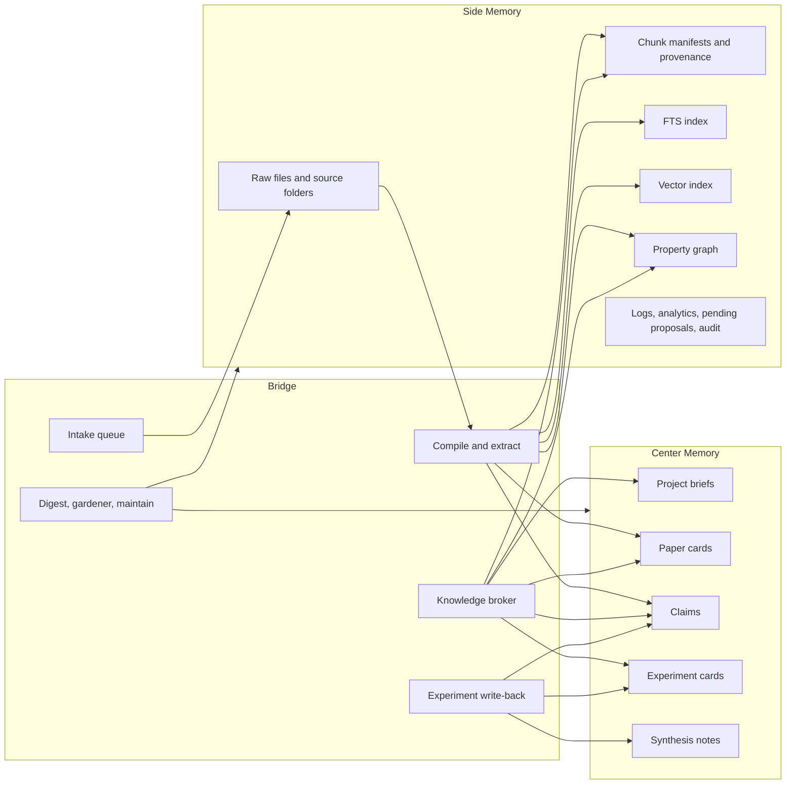

# Knowledge Architecture Implementation Plan

This document turns `knowledge_architecture_review.md` into a concrete implementation plan for the knowledge engine that powers `claude-code-agent` through the sibling `second-brain` package.

The target is not "better note search." The target is a research operating memory for long-running modeling work:

- medium-sized literature corpus, especially academic PDFs
- multi-day agent loops with many experiments and dead ends
- continuous retrieval of relevant literature and prior experiments
- bounded, comprehensible central knowledge
- durable side memory that can grow without overwhelming the center
- self-correction through conflict detection, review, maintenance, and incremental learning

## Outcome

At the end of this plan, the knowledge system should behave like this:

1. raw files, URLs, repos, and experiment artifacts enter through a durable intake path
2. the system stages and stores them safely
3. the system compiles them into bounded central knowledge objects
4. side indexes and chunk stores make the raw material searchable with provenance
5. the agent retrieves center knowledge plus side evidence on every relevant turn
6. the agent writes back new experiment outcomes, decisions, and failures into the same research memory
7. maintenance identifies conflicts, drift, stale summaries, and taxonomy gaps
8. the system improves from use without turning the center into an unreadable dump

## Current Starting Point In Code

The implementation plan starts from the actual ownership split already present in the codebase.

In `claude-code-agent`:

- `backend/app/tools/sb_tools.py` exposes `sb_search`, `sb_load`, `sb_reason`, `sb_ingest`, `sb_promote_claim`
- `backend/app/api/sb_api.py`, `backend/app/api/sb_pipeline.py`, and `backend/app/api/sb_gardener.py` expose the REST surface
- `backend/app/harness/wiring.py` and `backend/app/harness/injector.py` wire second-brain recall into the chat prompt
- `frontend/src/sections/KnowledgeSurface.tsx` and related panels are the current knowledge UI
- `.claude/settings.json` currently uses hooks for prompt-time `sb inject` and post-tool `sb reindex`

In `second-brain`:

- `src/second_brain/ingest/orchestrator.py` owns source ingest
- `src/second_brain/extract/worker.py` owns claim extraction from a source
- `src/second_brain/reindex.py` rebuilds graph and FTS indexes
- `src/second_brain/index/retriever.py` owns BM25 and hybrid retrieval
- `src/second_brain/inject/runner.py` owns prompt-time recall
- `src/second_brain/digest/*` owns proposal review and apply
- `src/second_brain/gardener/*` owns background proposal generation
- `src/second_brain/maintain/runner.py` owns lint, analytics, and maintenance

This plan assumes those ownership points stay recognizable. The goal is to evolve them, not replace them wholesale.

## Componentization Goal

The knowledge engine should not remain only an external sibling dependency that `claude-code-agent` happens to call.

The target shape is:

- a nested component inside `claude-code-agent`
- still a self-contained project in its own right
- still installable and runnable independently
- still documented well enough that a human or another coding agent can operate it without reading all of `claude-code-agent`

That means the long-term boundary should be:

- product-level host: `claude-code-agent`
- nested component: `second-brain` or a renamed equivalent knowledge-engine module
- stable standalone interface: CLI, docs, storage contract, and operator guide

This is not just packaging cleanup.

It matters because the knowledge engine has three simultaneous roles:

1. embedded subsystem of `claude-code-agent`
2. standalone knowledge system that can evolve with its own contracts
3. operator-facing component that Claude Code, Codex, or a human maintainer can help maintain directly

## Recommended Repository Shape

The recommended target is to vendor the knowledge engine into this repository as a first-class nested component while preserving a clean standalone boundary.

Suggested layout:

```text
claude-code-agent/
  components/
    second-brain/
      README.md
      pyproject.toml
      src/second_brain/
      tests/
      docs/
        architecture.md
        data-model.md
        operations.md
        integration.md
        evals.md
      AGENTS.md
      ops/
```

Recommended compatibility rule:

- keep the Python import package name `second_brain` stable during the migration
- avoid a breaking rename during the architectural rewrite unless there is a strong reason

That gives you:

- a nested component inside the main product
- a clean extraction boundary if you ever want to split it again
- a directory where docs, tests, and operator tooling live together

## Why A Nested Self-Contained Component Is The Right Choice

Rationale:

- the knowledge engine is becoming large enough to deserve its own architecture and operations surface
- the current sibling-repo arrangement creates friction in dependency management, docs, testing, and onboarding
- the agent-facing maintenance path should not be hidden inside host-app glue

Trade-off:

- vendoring the component into the repo increases monorepo complexity
- release discipline and ownership boundaries must become more explicit

Why this trade-off is worth it:

- the host product and the knowledge engine are tightly coupled in runtime behavior
- but they should still be separable in documentation, testing, and operator workflows

## Standalone Contracts The Component Must Own

The nested component should be understandable on its own.

That means it should own:

- its own `README.md`
- architecture documentation
- storage and data contract documentation
- operator runbook
- evaluation guide
- integration guide for host applications
- machine-facing maintenance instructions

Minimum documentation set:

- `README.md`
  - what it is
  - quickstart
  - setup
  - key commands
- `docs/architecture.md`
  - center / side / bridge model
  - ingest, compile, retrieval, write-back, maintenance flow
- `docs/data-model.md`
  - ids
  - object types
  - provenance
  - canonical vs derived stores
- `docs/operations.md`
  - ingest
  - reindex
  - digest
  - gardener
  - maintain
  - troubleshooting
- `docs/integration.md`
  - how `claude-code-agent` uses it
  - how another host could use it
- `docs/evals.md`
  - fixture corpus
  - retrieval evaluation
  - full-cycle E2E
- `AGENTS.md`
  - machine-facing operating instructions for Claude Code, Codex, and similar coding agents

## Agent-Operable By Design

The component should leave an explicit door open for Claude Code, Codex, and similar agents to help operate it.

That means two things:

1. the component exposes stable operator commands
2. the component documents safe maintenance workflows in a machine-readable and human-readable way

Recommended operator surface:

- `sb ingest`
- `sb extract`
- `sb compile`
- `sb reindex`
- `sb search`
- `sb load`
- `sb reason`
- `sb digest build`
- `sb digest apply`
- `sb maintain`
- `sb status`
- `sb eval`
- `sb doctor`

Recommended additional helper commands for this architecture:

- `sb compile-center`
  - compile paper cards, claims, and syntheses from side memory
- `sb record-experiment`
  - write structured experiment memory
- `sb broker recall`
  - emit the bounded recall packet set used by prompt-time and tool-time retrieval
- `sb doctor`
  - validate indexes, contracts, expected docs, and lifecycle health in one place

## Machine-Facing Operating Guide

The component should contain an `AGENTS.md` or equivalent contract specifically for coding agents.

It should include:

- what files are canonical
- what files are derived
- safe commands to run
- unsafe commands to avoid
- expected maintenance workflow
- how to run the deterministic E2E suite
- how to refresh indexes after canonical mutations
- how to inspect failed ingests
- how to apply digest actions safely
- how to verify retrieval quality after changes

Recommended philosophy:

- let Claude Code and Codex act as helpers to the knowledge engine
- do not make them implicit hidden dependencies for basic correctness

In other words:

- agents can help ingest
- agents can help classify
- agents can help review and maintain
- agents can help investigate retrieval regressions
- but the component still needs deterministic, host-independent operating guarantees

## LLM-Wiki Style Integration At The Component Level

The strongest `llm_wiki` idea to absorb into the nested component is not merely wiki generation.

It is the existence of a clear compiled center plus explicit operating documents.

That should be integrated here as:

- compiled center-memory objects
- a purpose or project brief per active modeling effort
- durable intake and review queues
- source-traceable compiled objects
- clear human-readable docs explaining how compilation works

This is a better fit than bolting on a separate wiki subsystem.

The knowledge engine should subsume the useful parts of `llm_wiki`:

- compiled knowledge
- staged ingest
- directional purpose context
- human review points

without creating a second parallel memory stack.

## New Workstream: Component Productization

This should be treated as a first-class implementation track, not an afterthought.

### Scope

- move the knowledge engine into a nested component directory
- preserve standalone package and CLI behavior
- add full component documentation
- add machine-facing operator instructions
- define the host integration boundary cleanly

### Acceptance

- the component can be understood from its own folder without reading the host app first
- the component can run its own tests and evals independently
- the host app consumes it through explicit interfaces, not through undocumented assumptions
- Claude Code and Codex have a documented path to help maintain it

### E2E Tests

`components/second-brain/tests/e2e/test_component_standalone_smoke.py`

- install and run the component standalone
- initialize a temp home
- ingest a fixture
- search it
- run maintain
- assert success without the host app

`claude-code-agent/backend/tests/integration/test_component_embedding_smoke.py`

- run the same component through the host app integration path
- assert host integration does not depend on undocumented filesystem assumptions

## Core Design: Center, Side, Bridge

The simplest correct mental model is:

- center: small, canonical, curated research memory
- side: large, high-churn, provenance-heavy supporting memory
- bridge: the lifecycle and retrieval machinery that keeps them aligned



## What Belongs In The Center

The center must stay bounded. That is the main guardrail against overwhelm.

The center should contain only canonical objects the agent can think with directly:

- `projects/`
  - project purpose
  - active question
  - constraints
  - benchmark targets
  - current hypotheses
- `papers/`
  - one compiled paper card per important source
  - key methods, claims, limitations, and provenance refs
- `claims/`
  - atomic assertions, linked to source and chunk evidence
- `experiments/`
  - hypothesis, setup, result, failure mode, decision, artifacts
- `syntheses/`
  - rolling project-level literature and experiment synthesis

The center should not store:

- raw PDF text
- every chunk verbatim
- every temporary extraction proposal
- every transient log line
- every UI action or pipeline event

Those belong in the side.

## What Belongs In The Side

The side is where the system can be large, noisy, and highly operational.

The side should hold:

- `sources/<slug>/raw/*`
- `sources/<slug>/_source.md`
- chunk manifests with section and page provenance
- `.sb/kb.sqlite`
- `.sb/vectors.sqlite`
- `.sb/graph.duckdb`
- `.sb/analytics.duckdb`
- `digests/pending.jsonl`
- `digests/*.actions.jsonl`
- `.sb/.state/pipeline.json`
- gardener audit logs
- failed-ingest traces
- retrieval evaluation fixtures and metrics

The side exists to support the center. It should be rich, but it is not what the agent injects whole into the prompt.

## How The Bridge Works

The bridge is the real engine.

It has five jobs:

1. intake
   - normalize files, URLs, repos, and later experiment artifacts
   - stage safely
   - de-duplicate
   - queue work durably
2. compile
   - process raw sources
   - create chunks
   - extract claims
   - compile paper cards
   - build derived indexes
3. broker retrieval
   - search side memory
   - map evidence back to center objects
   - rerank by active project and recent work
   - emit bounded recall packets
4. write back from modeling work
   - store experiments, failures, decisions, and new hypotheses
   - connect them to papers and claims
5. self-correct
   - detect conflicts and stale knowledge
   - propose or apply fixes
   - learn better taxonomy and extraction defaults

If this bridge is weak, the center and side drift apart. That is the main failure mode to avoid.

## Data Contract

### Canonical Storage Layout

This is the target storage contract.

| Path | Role | Canonical | Notes |
| --- | --- | --- | --- |
| `sources/<slug>/raw/*` | raw artifacts | yes | original files and fetch outputs |
| `sources/<slug>/_source.md` | processed source record | yes | source-level metadata and body |
| `sources/<slug>/_chunks.jsonl` or equivalent | source chunk manifest | rebuildable | deterministic from source processing |
| `papers/*.md` | paper cards | yes | bounded compiled literature memory |
| `claims/*.md` | atomic claims | yes | linked to evidence refs |
| `projects/*.md` | project briefs | yes | active research context |
| `experiments/*.md` | experiment cards | yes | results, failures, decisions |
| `syntheses/*.md` | rolling syntheses | yes | project summaries and literature synthesis |
| `.sb/graph.duckdb` | derived graph | no | rebuilt from canonical markdown |
| `.sb/kb.sqlite` | derived FTS | no | rebuilt from canonical markdown and chunks |
| `.sb/vectors.sqlite` | derived vectors | no | rebuilt from canonical markdown and chunks |
| `.sb/analytics.duckdb` | derived analytics | no | maintenance output |
| `digests/*.actions.jsonl` | review actions | no | operational queue output |
| `.sb/.state/pipeline.json` | pipeline ledger | no | runtime state only |
| `.sb/habits.yaml` | behavior control plane | yes | retrieval, extraction, maintenance policy |

### ID Rules

The current system is too dependent on filename assumptions. The new contract should be explicit:

1. frontmatter `id` is authoritative
2. filenames are conveniences, not primary keys
3. every relation stores ids, never raw filenames
4. lookup helpers must resolve by frontmatter id, not by path guess
5. every center object must carry provenance refs into side memory

Recommended ids:

- `src_<slug>` for sources
- `chk_<source_slug>_<sequence>` for chunks
- `pap_<source_slug>` for paper cards
- `clm_<slug>` for claims
- `prj_<slug>` for projects
- `exp_<project_slug>_<sequence>` for experiments
- `syn_<project_slug>_<topic>` for syntheses

### Labeling Rules

The system needs controlled labels, not just free-form tags.

Minimum required labels:

- `object_kind`
- `taxonomy`
- `project_id`
- `status`
- `source_kind`
- `evidence_level`
- `updated_at`

Recommended structured labels for research use:

- `model_family`
- `dataset`
- `metric`
- `task`
- `modality`
- `failure_mode`
- `time_horizon`

Policy:

- `taxonomy` stays controlled and relatively small
- free-form tags can exist, but they cannot replace controlled fields
- maintenance should propose label normalization, not silently invent exploding tag spaces

### Provenance Rules

Every claim or experiment the agent can act on should have traceable support.

Minimum provenance payload:

- `source_id`
- `chunk_id`
- `section_title`
- `page_start`
- `page_end`
- `snippet`

Without this, retrieval may look smart but will not be trustworthy during modeling work.

## Target Retrieval Output: Recall Packets

The current retrieval path returns isolated hits. The target system should return bounded recall packets that connect center and side.

Proposed packet shape:

```json
{
  "center_id": "pap_transformer_long_context",
  "center_kind": "paper",
  "score": 0.91,
  "summary": "Hybrid attention and state-space mixing improves long-context forecasting.",
  "project_relevance": "directly informs the current long-horizon forecasting task",
  "supporting_evidence": [
    {
      "source_id": "src_hybrid_long_context",
      "chunk_id": "chk_src_hybrid_long_context_07",
      "section_title": "Results",
      "page_start": 8,
      "page_end": 8,
      "snippet": "The hybrid model improved AUROC by 2.7 points over attention-only baselines."
    }
  ],
  "related_claim_ids": ["clm_hybrid_improves_long_context"],
  "related_experiment_ids": ["exp_longctx_014"],
  "open_conflicts": ["clm_recurrence_beats_attention_for_very_long_context"]
}
```

That packet is what should feed:

- prompt-time injection
- `sb_search`
- UI recall surfaces
- later synthesis passes

This is the main connection between center and side.

## Phase 0: Shared Fixture Corpus And Contracts

This phase exists so later work is measurable and deterministic.

### Scope

- create a shared research-loop fixture corpus
- define canonical ids, labels, and provenance contracts
- create stable fake extraction and gardener clients for deterministic tests
- define the full-cycle E2E before changing behavior

### Files To Add

In `second-brain`:

- `tests/fixtures/research_loop/`
- `tests/helpers/research_loop.py`
- `tests/e2e/test_research_cycle_smoke.py`

In `claude-code-agent`:

- `backend/tests/fixtures/research_loop/`
- `backend/tests/integration/test_kb_research_cycle_smoke.py`
- `frontend/e2e/knowledge-cycle.spec.ts`

### Fixture Corpus

The fixture corpus should include:

1. three literature sources
   - one paper favoring attention-only modeling
   - one paper favoring recurrence or memory for long context
   - one paper favoring a hybrid architecture
2. one project brief
   - long-horizon modeling objective
   - dataset and metric targets
   - constraints
3. two experiment results
   - one failed attempt
   - one partially successful attempt
4. at least one conflict pair
   - two claims that cannot both be true without qualification

### Acceptance

- every later E2E test reuses this fixture corpus or a small variation of it
- retrieval qrels can be written against it
- no test depends on live external network or a real LLM

### E2E Tests

`second-brain/tests/e2e/test_research_cycle_smoke.py`

- seed temp `SECOND_BRAIN_HOME`
- ingest fixture notes or paper text
- extract deterministic claims with fake client
- reindex
- assert searchable claims and sources exist

`claude-code-agent/backend/tests/integration/test_kb_research_cycle_smoke.py`

- boot app with temp second-brain home
- hit ingest API
- hit memory session route
- assert pipeline state and recall path are alive

`frontend/e2e/knowledge-cycle.spec.ts`

- boot frontend against test backend
- open knowledge surface
- upload a file
- observe pipeline transition and visible recall UI

## Phase 1: Fix Lifecycle Correctness First

This phase fixes the known correctness cracks before adding sophistication.

### Problems To Fix

- ingest does not guarantee immediate searchability
- `sb_promote_claim` does not guarantee immediate searchability
- URL and repo ingest are supported in second-brain converters but not properly exposed in the app tool
- gardener and digest action envelopes are mismatched
- claim lookup assumes filename equals id
- service correctness depends too much on `.claude/settings.json` hooks

### Concrete Changes

In `claude-code-agent`:

- update `backend/app/tools/sb_tools.py`
  - `sb_ingest()` should support `http(s)`, `gh:`, and `file://` by constructing the correct `IngestInput`
  - `sb_promote_claim()` should trigger an internal reindex or enqueue an index job
- update `backend/app/api/sb_api.py`
  - ingest routes should return lifecycle state that guarantees whether the source is merely accepted or fully indexed
- keep `.claude/settings.json` hook-based reindex as a backup only, not as the primary correctness path

In `second-brain`:

- normalize proposal payloads in:
  - `src/second_brain/digest/schema.py`
  - `src/second_brain/digest/pending.py`
  - `src/second_brain/digest/applier.py`
  - `src/second_brain/gardener/protocol.py`
  - `src/second_brain/gardener/runner.py`
  - gardener pass emitters
- fix `_load_claim()` in `digest/applier.py` to resolve by frontmatter id

### Acceptance

- after ingest, the new source is searchable without manual reindex
- after `sb_promote_claim`, the new claim is searchable without manual reindex
- gardener proposals can round-trip through pending, digest build, and apply
- no lifecycle test depends on filename-based claim lookup

### E2E Tests

`second-brain/tests/e2e/test_research_cycle_ingest_to_search.py`

- ingest a source
- assert `_source.md` exists
- assert `reindex` is triggered or queued and completed
- search immediately
- assert hit exists

`second-brain/tests/e2e/test_research_cycle_gardener_digest_apply.py`

- emit a gardener proposal
- build digest
- apply digest entry
- assert the intended KB mutation occurred

`claude-code-agent/backend/tests/integration/test_kb_api_ingest_to_recall.py`

- POST `/api/sb/ingest`
- assert pipeline ledger shows ingest completion
- call `/api/sb/memory/session/{session_id}`
- assert recall includes the newly indexed item

## Phase 2: Add Chunked Side Memory And Provenance

This phase solves the biggest retrieval gap for academic papers.

### Scope

- move retrieval from whole-source rows toward chunk-aware indexing
- preserve section and page provenance
- surface snippets in retrieval hits

### Concrete Changes

In `second-brain`:

- add a chunk schema, for example:
  - `src/second_brain/schema/chunk.py`
- add a chunker module, for example:
  - `src/second_brain/index/chunker.py`
- write per-source chunk manifests, likely beside `_source.md`
- update `src/second_brain/reindex.py`
  - index chunks into FTS
  - embed chunks into vectors
  - preserve source summary rows only as secondary recall objects
- update `src/second_brain/index/retriever.py`
  - return `snippet`
  - return chunk provenance metadata
  - support grouping multiple chunk hits under one source or paper

### Storage Policy

- raw source stays canonical
- chunk manifests are deterministic rebuild artifacts
- chunk ids must be stable across rebuilds when source text has not changed materially

### Acceptance

- searching for a concept from page 8 of a paper returns a chunk-level hit with page and section metadata
- prompt-time recall can surface evidence, not just ids and scores
- vector retrieval operates over chunks, not only whole claims and sources

### E2E Tests

`second-brain/tests/e2e/test_research_cycle_chunk_retrieval.py`

- ingest a paper fixture
- chunk and index it
- search for a section-level concept
- assert top hit includes `chunk_id`, `section_title`, `page_start`, `page_end`, and `snippet`

`second-brain/tests/e2e/test_research_cycle_pdf_provenance.py`

- ingest a real sample PDF
- ensure chunking preserves page spans
- ensure retrieved evidence maps back to the correct page range

`claude-code-agent/backend/tests/integration/test_kb_api_retrieval_provenance.py`

- call search and memory-session endpoints
- assert the response exposes provenance fields, not just ids

## Phase 3: Build The Center Memory

This phase creates the bounded central knowledge the agent can reason over directly.

### Scope

- add paper cards
- add project briefs
- add experiment cards
- add synthesis notes
- keep claims as atomic center objects

### Concrete Changes

Add a new center-memory package in `second-brain`, for example:

- `src/second_brain/research/schema.py`
- `src/second_brain/research/compiler.py`
- `src/second_brain/research/writeback.py`
- `src/second_brain/research/index.py`

Add markdown directories:

- `papers/`
- `projects/`
- `experiments/`
- `syntheses/`

Compile rules:

- each important source can yield one `paper` card
- many chunks can support one paper card
- many claims can link to one paper card
- a project brief is manually seeded and then maintained by agent and user collaboration
- experiments are created from modeling work, not from literature ingest
- syntheses aggregate papers, claims, and experiments into a bounded project view

### Boundedness Policy

The center must stay small enough for a human to inspect directly.

Suggested guardrails:

- one paper card per source, not one per chunk
- only promote claims that are actionable or materially relevant
- create experiment cards only for meaningful runs, not every log event
- synthesis notes roll forward instead of multiplying endlessly

### Acceptance

- the center tree is understandable without reading raw files
- every center object has side-memory provenance refs
- the number of center documents grows much slower than the number of chunks and raw files

### E2E Tests

`second-brain/tests/e2e/test_research_cycle_center_compile.py`

- ingest three papers
- compile paper cards and claims
- assert `papers/`, `claims/`, and indexes are coherent

`second-brain/tests/e2e/test_research_cycle_center_boundedness.py`

- ingest several updates to the same source family
- assert the center grows in bounded objects rather than raw chunk count

`claude-code-agent/backend/tests/integration/test_kb_center_surface_api.py`

- fetch center-memory data for the UI
- assert grouped projects, papers, claims, and experiments are available

## Phase 4: Add A Knowledge Broker

This phase creates the explicit connection between the center and the side.

### Scope

- one broker for retrieval and recall packet assembly
- shared logic for prompt-time recall and tool-time search
- project-aware reranking

### Concrete Changes

Add a broker module in `second-brain`, for example:

- `src/second_brain/research/broker.py`

Responsibilities:

1. resolve active project context
2. search side memory
3. gather linked center objects
4. rerank by project purpose, recent experiments, and conflicts
5. emit bounded recall packets

Then route both:

- `src/second_brain/inject/runner.py`
- `backend/app/tools/sb_tools.py::sb_search`

through the broker, not separate retrieval paths.

### Acceptance

- passive recall and active search use the same underlying ranker
- project context changes ranking
- recall blocks contain evidence snippets and conflicts, not only ids

### E2E Tests

`second-brain/tests/e2e/test_research_cycle_prompt_and_search_parity.py`

- run a prompt-style query and a tool-style query
- assert the same top center ids are returned

`second-brain/tests/e2e/test_research_cycle_project_aware_ranking.py`

- use the same paper corpus with two different project briefs
- assert retrieval order changes appropriately

`claude-code-agent/backend/tests/integration/test_kb_prompt_recall_e2e.py`

- build system prompt or memory-session recall
- assert project brief, relevant literature, and related experiments appear in one bounded packet set

## Phase 5: Unify Experiment Memory And Literature Memory

This phase makes the system useful for real modeling loops.

### Scope

- write experiment outcomes into the same memory substrate as literature
- connect hypotheses, failures, results, and decisions to papers and claims
- reduce the split between `WikiEngine` operational memory and second-brain research memory

### Concrete Changes

In `claude-code-agent`:

- add new tools or APIs such as:
  - `sb_record_experiment`
  - `sb_record_hypothesis`
  - `sb_record_decision`
- define how existing `WikiEngine` scratch work promotes into project or experiment center objects

In `second-brain`:

- add schemas and writers for experiments and decisions
- add graph relations such as:
  - `tests_claim`
  - `supports_claim`
  - `contradicts_claim`
  - `fails_because_of`
  - `informs_project`
  - `supersedes_experiment`

### Policy

- `WikiEngine` can remain a scratchpad and session log
- durable modeling memory should live in center-memory project and experiment docs
- maintenance should eventually reconcile useful wiki findings into structured project memory

### Acceptance

- a failed experiment is searchable later
- retrieval for a modeling task returns both literature evidence and past experiment outcomes
- project syntheses can refer to both paper claims and experiment results

### E2E Tests

`second-brain/tests/e2e/test_research_cycle_experiment_writeback.py`

- create a project
- write an experiment result
- reindex
- search for the failure mode
- assert the experiment is retrievable and linked to the project

`second-brain/tests/e2e/test_research_cycle_literature_plus_experiment_recall.py`

- seed a literature claim and a failed experiment on the same topic
- query through the broker
- assert both appear in the recall packet set

`claude-code-agent/backend/tests/integration/test_kb_modeling_loop_writeback.py`

- simulate a modeling run that records an experiment outcome
- then simulate a follow-up query
- assert the follow-up retrieval uses that prior experiment

## Phase 6: Make Maintenance A Real Self-Correction Loop

This phase strengthens digest, gardener, and maintain into a coherent loop.

### Scope

- conflict detection
- taxonomy drift detection
- stale-summary detection
- dedupe and edge cleanup
- compact and rebuild without losing center knowledge

### Concrete Changes

In `second-brain`:

- align all proposal payloads to one dispatch contract
- make digest apply id-based and deterministic
- extend maintenance to consider:
  - unresolved contradictions
  - low-provenance claims
  - stale paper cards
  - taxonomy ambiguity
  - center growth pressure
- ensure compaction touches derived indexes, not canonical center markdown

### Acceptance

- conflict proposals can be emitted, reviewed, applied, and reindexed successfully
- resolved contradictions reduce conflict backlog and affect retrieval
- maintenance can rebuild side indexes without breaking center references

### E2E Tests

`second-brain/tests/e2e/test_research_cycle_conflict_resolution.py`

- seed contradictory claims
- build digest
- apply a contradiction resolution
- reindex
- assert:
  - resolution artifact exists
  - conflict count drops
  - retrieval reflects the resolved state

`second-brain/tests/e2e/test_research_cycle_taxonomy_learning.py`

- simulate repeated user overrides
- run maintain
- assert a taxonomy proposal is created or applied according to habits

`second-brain/tests/e2e/test_research_cycle_compaction_preserves_recall.py`

- enlarge indexes
- run maintain and compaction
- assert recall before and after remains materially stable

`claude-code-agent/backend/tests/integration/test_kb_maintain_route_e2e.py`

- call `/api/sb/maintain/run`
- assert updated ledger, reindex summary, and no broken recall afterward

## Phase 7: Redesign The Knowledge Surface Around Center And Side

This phase exposes the right model to the user.

### Scope

- the main knowledge surface should present center memory first
- side-memory operations should move into explicit drawers or tabs
- the UI should let the user see why something was recalled

### Concrete Changes

In `frontend`:

- evolve `frontend/src/sections/KnowledgeSurface.tsx`
  - center pane becomes compiled research memory
  - left navigation groups by `Projects`, `Papers`, `Claims`, `Experiments`, `Syntheses`
- keep side operations in drawers:
  - ingest
  - graph
  - digest
  - gardener
  - raw source explorer
  - provenance/evidence drawer
- extend `frontend/src/lib/pipeline-store.ts`
  - optionally track finer internal phases such as `compile` and `index`

### Acceptance

- the user can inspect center knowledge without seeing raw chunk noise
- the user can open a recalled item and inspect its evidence path into side memory
- pipeline state communicates where knowledge is in the lifecycle

### E2E Tests

`frontend/e2e/knowledge-cycle.spec.ts`

- upload a source
- observe lifecycle indicators
- navigate to the resulting paper card
- inspect supporting evidence

`frontend/e2e/knowledge-conflict.spec.ts`

- open digest
- apply a conflict resolution
- observe updated center state

`frontend/e2e/knowledge-recall.spec.ts`

- ask a modeling-oriented query
- verify the UI surfaces relevant project, literature, and experiment context

## Phase 8: Add Evaluation And Quality Gates

Without explicit measurement, the system will drift back into "seems okay" behavior.

### Scope

- retrieval evaluation
- provenance coverage evaluation
- lifecycle latency evaluation
- center boundedness evaluation
- conflict closure evaluation

### Metrics To Track

- recall@k on fixture qrels
- MRR on literature queries
- percent of retrieval hits with snippet and page provenance
- ingest-to-searchable latency
- experiment-writeback-to-searchable latency
- unresolved contradiction count and age
- center document count versus source and chunk count
- digest proposal apply success rate
- gardener proposal schema validity rate

### Quality Gates

Block releases or mark the pipeline unhealthy when:

- prompt-time recall and tool-time search diverge materially
- retrieved hits lack provenance
- conflicts remain open beyond policy threshold
- center growth exceeds the boundedness policy
- ingest completes but recall fails

### E2E Tests

`second-brain/tests/eval/test_research_cycle_retrieval.py`

- run retrieval qrels for the shared research-loop fixture
- assert minimum recall and provenance thresholds

`claude-code-agent/backend/tests/integration/test_kb_slo_smoke.py`

- measure ingest-to-recall and promote-to-recall timing in a deterministic fixture

## Canonical Full-Cycle E2E

This is the most important test in the whole plan. It should exist early and keep growing.

Recommended location:

- `claude-code-agent/backend/tests/integration/test_kb_full_research_cycle.py`

### Scenario

1. create a temp `SECOND_BRAIN_HOME`
2. seed habits and a project brief
3. upload three literature fixtures through the same ingest API the UI uses
4. assert:
   - `sources/<slug>/raw/*` exists
   - `_source.md` exists
   - pipeline state records ingest
5. run compile or extraction with deterministic fake clients
6. assert:
   - chunk manifests exist
   - `papers/*.md` exists
   - `claims/*.md` exists
7. assert:
   - `kb.sqlite`, `vectors.sqlite`, and `graph.duckdb` exist
   - retrieval returns chunk provenance
8. query the broker through both:
   - prompt-time recall path
   - tool-time search path
9. assert:
   - same top center ids
   - snippets and page spans present
   - project brief affects ranking
10. record two experiment outcomes
11. assert:
    - experiment cards exist
    - graph relations connect experiments to claims and project
12. seed one contradiction and one taxonomy drift
13. run digest build
14. assert:
    - pending entries emitted
    - action schema is valid
15. apply the relevant digest action
16. run maintain
17. assert:
    - contradiction backlog reduced
    - indexes rebuilt
    - recall still works
    - center docs remain intact
18. open the knowledge surface in Playwright
19. assert:
    - project, paper, claim, and experiment nodes are visible
    - evidence drawer shows provenance

### What This Test Protects

- lifecycle closure
- center/side integrity
- retrieval usefulness
- self-correction loop health
- UI truthfulness

## Test Matrix By Component

| Component | Primary owner | Primary E2E | What it proves |
| --- | --- | --- | --- |
| intake and staging | `ingest/orchestrator.py`, `sb_api.py`, `sb_tools.py` | `test_research_cycle_ingest_to_search.py` | sources are accepted, stored, and indexed |
| chunking and provenance | `reindex.py`, retrievers, chunker | `test_research_cycle_chunk_retrieval.py` | academic content is retrievable with evidence |
| center compiler | new `research/*` package | `test_research_cycle_center_compile.py` | center objects are created and bounded |
| brokered recall | new `research/broker.py`, `inject/runner.py`, `sb_tools.py` | `test_research_cycle_prompt_and_search_parity.py` | prompt and tool retrieval agree |
| project memory | new `projects/*.md` and broker context | `test_research_cycle_project_aware_ranking.py` | project context changes recall correctly |
| experiment write-back | new experiment writer and tools | `test_research_cycle_experiment_writeback.py` | modeling outcomes become durable knowledge |
| conflict resolution | digest and maintain stack | `test_research_cycle_conflict_resolution.py` | contradictions can be surfaced and resolved |
| taxonomy learning | habits and maintain | `test_research_cycle_taxonomy_learning.py` | the system gets better from use |
| UI truth surface | `KnowledgeSurface.tsx`, drawers, stores | `frontend/e2e/knowledge-cycle.spec.ts` | the user sees the real lifecycle and evidence |

## Recommended Order Of Implementation

The order matters.

1. Phase 0
   - shared fixtures and contracts
   - start component productization
2. Phase 1
   - correctness and lifecycle closure
   - establish explicit standalone component contracts
3. Phase 2
   - chunked side memory and provenance
4. Phase 3
   - center memory
5. Phase 4
   - brokered retrieval
6. Phase 5
   - experiment write-back
7. Phase 6
   - self-correction loop
8. Phase 7
   - UI reshape
9. Phase 8
   - evaluation and quality gates

This order is deliberate:

- there is no value in advanced autonomy on top of stale or unsearchable knowledge
- there is no value in a center memory before retrieval can justify what enters it
- there is no value in maintenance if experiment memory is still disconnected from literature memory
- there is no value in a strategically important subsystem staying undocumented and packaging-fragile while it grows

## What Should Not Be Done

These are explicit anti-goals.

- do not let the center absorb raw chunk text
- do not keep prompt-time recall and tool-time search on different ranking logic
- do not rely on editor hooks for core lifecycle correctness
- do not store relations by filename assumptions
- do not let free-form tags replace controlled labels
- do not make the knowledge UI a thin graph viewer over raw noise
- do not let gardener write actions that digest cannot replay

## First Milestone Definition

The first milestone should be considered complete when all of the following are true:

1. ingest through the app makes a source searchable without manual intervention
2. claim promotion through the app makes a claim searchable without manual intervention
3. a deterministic full-cycle E2E exists and passes
4. retrieval hits include snippet and provenance fields
5. gardener and digest use one action envelope
6. claim lookup is id-based, not filename-based
7. the component has its own standalone `README`, architecture docs, operations docs, and machine-facing operator guide

That milestone does not yet deliver the full research operating memory, but it closes the current correctness holes and creates a reliable base for the next phases.

## Final Direction

The correct long-term shape for this engine is:

- a bounded center the agent can think with
- a rich side that keeps all provenance and operational detail
- a broker that turns side evidence into center-aware recall
- a write-back loop that stores modeling work next to literature memory
- a maintenance loop that continuously reduces drift, conflict, and noise

That is how this system becomes a real driver of iterative model improvement rather than a passive support tool.

## POC Priority Shift: Quality Before Budget

For the proof-of-concept phase, the priority order should be:

1. retrieval quality
2. provenance quality
3. lifecycle correctness
4. experiment-memory usefulness
5. maintenance correctness
6. token and cost optimization

This is an explicit revision to the plan.

The system should not prematurely optimize for prompt budget if doing so weakens:

- literature recall
- evidence richness
- retrieval parity between prompt-time and tool-time
- experiment write-back visibility
- conflict detection and repair quality

The important distinction is:

- prompt budget is a runtime cost concern
- cognitive overload is a reasoning quality concern

The plan still keeps a bounded center, but that is because the agent and the human both need a clear thinking surface, not because the first POC should be aggressively token-thrifty.

During the POC:

- prefer richer recall packets over smaller ones
- prefer stronger retrieval coverage over tighter token ceilings
- prefer correctness of ingest-to-search-to-recall over cheaper maintenance runs
- prefer explicit provenance over compact but opaque summaries

Only after the retrieval and write-back loop is clearly useful should cost and prompt compression become first-class optimization targets.

### Important Clarification: POC Scope Does Not Mean POC Engineering Quality

In this plan, `POC` refers to:

- operating mode
- evaluation priority
- runtime settings
- willingness to spend more context and model quality to validate the design

It does not mean:

- throwaway code
- loose schemas
- weak tests
- unclear ownership
- brittle migrations
- temporary contracts that will obviously be replaced

The implementation quality target should remain:

- production-grade
- comprehensive
- typed and testable
- future-proof in storage and API contracts
- deterministic where possible
- observable and debuggable

That means the correct stance is:

- proof-of-concept on product behavior
- production-grade on code quality

If there is a choice between a shortcut that validates the idea quickly and an implementation that establishes the right long-term contract at slightly higher effort, prefer the latter unless it blocks learning entirely.

### Runtime Assumption For The POC

The plan should assume a high-context, high-quality model class for the POC, for example an Opus-class long-context model.

That changes the runtime bias:

- richer evidence packets are acceptable
- larger retrieval fan-out is acceptable
- more source material can be handed to synthesis and maintenance passes
- higher-quality compile and write-back passes are preferred over cheaper ones

Even under that assumption, the center should still stay bounded.

That boundedness is retained because:

- reasoning quality still degrades with irrelevant context
- humans still need inspectable canonical knowledge
- maintenance and debugging still benefit from a stable central layer

So the plan is not "dump everything into a 1M-context prompt."

The plan is:

- use large-context models to improve retrieval-backed synthesis quality
- keep the knowledge architecture disciplined so that the system remains inspectable and reliable

## Design Rationale And Trade-Offs

### 1. Center And Side Are Separated To Protect Reasoning Quality

Rationale:

- the center is what the agent should think with directly
- the side is where the large and noisy evidence substrate can grow

Trade-off:

- this adds a broker layer and promotion logic
- but it avoids turning the main knowledge surface into an unbounded pile of chunks, logs, and raw source text

Why this remains true even when prompt budget is deprioritized:

- a smaller center is not only about API cost
- it is mainly about keeping the reasoning surface legible and stable

### 2. Markdown Remains Canonical Because Recoverability Matters More Than Runtime Convenience

Rationale:

- canonical knowledge should stay inspectable and diffable
- derived stores can be rebuilt when index logic changes

Trade-off:

- rebuild and reindex become part of the lifecycle
- internal correctness requires strong E2E tests around rebuild paths

Why this is the right trade-off for the POC:

- it makes failure analysis easier
- it avoids hiding defects inside opaque database state

### 3. Chunked Side Memory Is Chosen Because Academic PDFs Need Fine-Grained Retrieval

Rationale:

- source-level indexing is too coarse for papers
- claims and decisions need page- and section-level evidence

Trade-off:

- more complex indexing
- more objects to manage in retrieval and graph linking

Why this should be done early:

- without chunk-level evidence, the proof of concept will look plausible but not actually be research-grade

### 4. One Broker Should Drive Both Passive Recall And Active Search

Rationale:

- the agent should not have one weaker recall brain and one stronger manual search brain
- prompt-time and tool-time retrieval should agree materially

Trade-off:

- shared broker logic becomes a critical dependency
- ranker changes have broader effects and need evaluation

Why this is worth it:

- it removes one of the biggest current inconsistencies in the engine

### 5. Experiment Memory Must Live Next To Literature Memory

Rationale:

- for multi-day modeling work, past failed experiments are often as useful as papers
- the agent should retrieve prior modeling results alongside relevant literature

Trade-off:

- the schema becomes broader than a pure literature KB
- maintenance has to reason about more object types

Why this is necessary:

- without experiment write-back, the engine supports research but does not actually drive it

### 6. Proposal-First Maintenance Is Still The Right Default Early On

Rationale:

- maintenance logic is still structurally brittle today
- digest and gardener contracts are not yet strong enough to trust broad autonomous writes

Trade-off:

- slower self-improvement
- more review friction

Why this should still stay conservative even in a POC:

- quality-first does not mean unsafe autonomy-first
- retrieval richness can be liberal while write mutation remains conservative

## Current Defaults And Recommended POC Overrides

This section distinguishes between:

- current defaults already encoded in the live code
- recommended proof-of-concept overrides to prioritize quality over token and cost thrift

### Retrieval

Current defaults in code:

- `retrieval.prefer = "claims"`
- `retrieval.default_k = 10`
- `retrieval.default_scope = "both"`
- `retrieval.mode = "hybrid"`
- `retrieval.embedding_model = "local"`
- `retrieval.rrf_k = 60`

Recommended POC stance:

- keep `mode = "hybrid"`
- keep `rrf_k = 60`
- increase `default_k` from `10` to `25`
- keep `default_scope = "both"`
- keep hybrid degradation behavior when vectors are absent, but treat that as degraded POC quality, not as an equally acceptable mode

Rationale:

- the POC should favor recall coverage and ranking quality
- missing a relevant paper is worse than spending more tokens on retrieval

### Prompt-Time Recall

Current defaults in code:

- `injection.enabled = true`
- `injection.k = 5`
- `injection.max_tokens = 800`
- `injection.min_score = 0.2`
- skip patterns filter command-like prompts

Recommended POC stance:

- increase `injection.k` from `5` to `12`
- increase `injection.max_tokens` from `800` to `6000`
- keep `min_score = 0.2` for now
- replace BM25-only passive recall with the same brokered retrieval path used by active search as soon as Phase 4 lands

Rationale:

- the current bottleneck is underexposed knowledge, not overexposed knowledge
- `min_score` should not be loosened immediately because that risks recall spam before evaluation exists
- `k` and token ceiling can be relaxed much more aggressively in a high-context POC
- the main remaining constraint is reasoning signal quality, not raw context availability

### Extraction

Current defaults in code:

- `default_density = "moderate"`
- `papers/* = "dense"`
- `blog/* = "sparse"`
- `news/* = "sparse"`
- `notes/* = "moderate"`
- `repos/* = "sparse"`
- `require_quote_for_extracted = true`
- `max_inferred_per_source = 20`

Recommended POC stance:

- keep `papers/* = "dense"`
- keep `require_quote_for_extracted = true`
- keep `max_inferred_per_source = 20`

Rationale:

- these defaults are already quality-oriented rather than budget-oriented
- they protect against low-quality claim extraction and unsupported inference

### Taxonomy And Labeling

Current defaults in code:

- taxonomy roots include `papers/ml`, `papers/systems`, `blog`, `news`, `notes/*`, `repos/*`
- `taxonomy.enforce = "soft"`

Recommended POC stance:

- keep `enforce = "soft"`
- add research-specific controlled labels in center objects before making enforcement stricter

Rationale:

- the schema needs to evolve while the object model is still being proven
- strict enforcement too early will create operational friction before the right labels are known

### Digest

Current defaults in code:

- `digest.enabled = false`
- passes on by default include reconciliation, wiki bridge, taxonomy drift, stale review, edge audit
- `min_entries_to_emit = 0`
- `skip_ttl_days = 14`

Recommended POC stance:

- enable digest in the POC branch or test environment
- keep `skip_ttl_days = 14`
- keep `min_entries_to_emit = 0`

Rationale:

- the POC needs to prove the full self-correction loop end to end
- disabling digest by default is reasonable for a stable product, but too conservative for validating the engine design

### Gardener

Current defaults in code:

- `mode = "proposal"`
- enabled passes: `extract`, `re_abstract`, `semantic_link`
- disabled passes: `dedupe`, `contradict`, `taxonomy_curate`, `wiki_summarize`
- `max_cost_usd_per_run = 0.50`
- `max_tokens_per_source = 8000`
- `dry_run = false`

Recommended POC stance:

- keep `mode = "proposal"`
- keep the pass set conservative at first
- raise `max_cost_usd_per_run` from `0.50` to `10.00`
- raise `max_tokens_per_source` from `8000` to `50000`
- in the POC environment, prefer routing high-value passes through the highest-quality long-context model tier rather than optimizing for cheaper tiers first

Rationale:

- the POC should not stall because the maintenance budget is too tight
- proposal mode still keeps write risk low while allowing richer pass behavior

### Model Tiering For The POC

Recommended runtime posture:

- use the strongest available long-context model for:
  - paper compilation
  - synthesis generation
  - difficult semantic linking
  - experiment-to-literature reconciliation
- keep smaller or cheaper models only for:
  - simple normalization
  - lightweight heuristics
  - background sanity checks where failure has low consequence

Rationale:

- the goal of the POC is to validate that the architecture can produce materially better research behavior
- if weak model choices hide the architecture's upside, the POC result will be misleading

### Engineering Quality Requirements During The POC

The following should still be treated as mandatory from the start:

- stable ids and storage contracts
- deterministic fixture-based E2E coverage
- idempotent ingest and reindex behavior
- explicit schema validation on proposals and center objects
- structured telemetry for lifecycle phases
- failure isolation between ingest, retrieval, digest, gardener, and maintain
- compatibility-minded APIs rather than one-off experimental route shapes

This is how the POC stays future-proof instead of becoming an expensive prototype that must be rewritten.

### Learning And Maintenance

Current defaults in code:

- learning enabled
- `threshold_overrides = 3`
- `rolling_window_days = 90`
- nightly maintenance enabled at `03:30`
- conflicts `grace_period_days = 14`
- conflicts `cluster_threshold = 3`

Recommended POC stance:

- keep these values initially
- do not tighten them until the retrieval and correction loops are empirically validated

Rationale:

- these thresholds are not the current bottleneck
- the bigger problem today is lifecycle and retrieval quality, not overactive learning

## POC Rule Of Thumb

Until the first end-to-end research-cycle demo passes convincingly, use this decision rule:

- choose the option that improves retrieval quality, provenance quality, or research-memory usefulness
- only reject that option on budget grounds if it makes the system operationally unusable

That is the correct bias for this proof-of-concept phase.

## Obsidian Refinement And Visualization

After reviewing [kytmanov/obsidian-llm-wiki-local](https://github.com/kytmanov/obsidian-llm-wiki-local), the right refinement is not to make Obsidian the knowledge engine.

The right refinement is:

- keep `second-brain` canonical
- generate an Obsidian-compatible projection for graph browsing and review
- import the good parts of the LLM wiki pattern:
  - raw vs published separation
  - draft / approve / reject lifecycle
  - alias normalization
  - broken-link repair
  - stub creation
  - generated hub pages
- reject the parts that do not fit this use case:
  - concept-only storage
  - vault-as-database
  - embedding-free retrieval as the main strategy
  - local-model assumptions

For this project, Obsidian should be:

- a human-facing graph view over center memory
- a review surface for drafts, conflicts, and syntheses
- a navigation layer that connects projects, papers, experiments, claims, and questions

It should not be:

- the source of truth
- the primary retrieval engine
- the storage system for low-level side memory

The most important design consequence is this:

- center pages become graph-visible objects
- side memory remains the evidence substrate
- source summaries are the bridge
- raw chunks stay out of the visible graph by default

That is the cleanest way to get the advantages of Obsidian visualization without overwhelming the center or weakening retrieval.

See the component-level design note here:

- [components/second-brain/docs/obsidian-visualization.md](components/second-brain/docs/obsidian-visualization.md)
