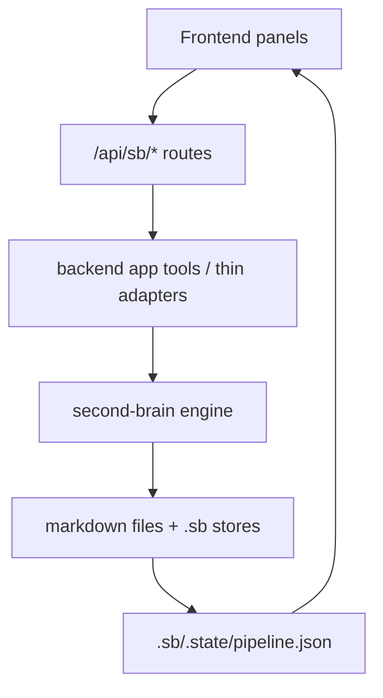
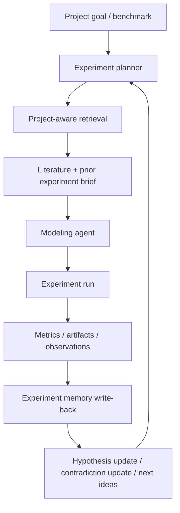
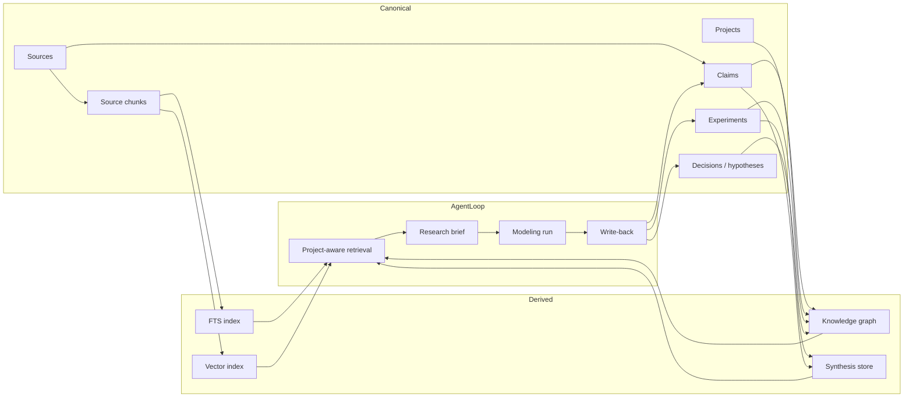

# Knowledge Architecture Review

Date: 2026-04-20

Scope: `claude-code-agent` + its linked `second-brain` package, focused on the "knowledge / LLM / second brain" subsystem as it exists in this workspace today.

## Executive Summary

The current system is a useful starting point, but it is not yet the right knowledge engine for the job you described.

What it is good at today:

- storing markdown-backed sources and claims
- rebuilding deterministic indexes from markdown
- exposing retrieval and graph-walk tools to the agent
- surfacing maintenance work through digest / maintain / gardener UI loops

What it is not good at today:

- acting as the main driver for a multi-day modeling program
- progressively feeding literature into the agent during active experimentation
- remembering experimental outcomes in the same knowledge plane as literature
- keeping ingest -> extraction -> retrieval -> refinement truly end-to-end

The core problem is architectural: the current engine is mostly a curated research note system plus maintenance workflows. Your target is different. You need a project-aware research memory and experiment memory that continuously helps the agent decide what to try next, what papers matter now, what assumptions have already failed, and what evidence should refine the current model.

Right now, the engine is more "knowledge hygiene + claim store" than "active research copilot for iterative modeling".

## What This Review Is Based On

This review is grounded in the current code, not in assumptions. The main ownership points are:

- `backend/pyproject.toml:40-42` links the backend to the sibling `second-brain` package.
- `backend/app/config.py:143-150` enables the feature when `SECOND_BRAIN_HOME/.sb` exists.
- `backend/app/harness/wiring.py:222-266` bridges second-brain retrieval into prompt injection.
- `backend/app/harness/injector.py:190-212` inserts `## Knowledge Recall` into the prompt.
- `backend/app/api/chat_api.py:641-667` assembles the full prompt and `chat_api.py:1092-1107` registers `sb_*` tools.
- `backend/app/tools/sb_tools.py` is the app-side shim for search / load / reason / ingest / promote.
- `backend/app/api/sb_api.py`, `backend/app/api/sb_pipeline.py`, and `backend/app/api/sb_gardener.py` expose the UI-facing REST surface.
- `second-brain/src/second_brain/` owns the real ingest, reindex, retrieval, injection, digest, maintain, gardener, and habits logic.

## Intended Use Case

Your stated target is:

- a medium-sized local corpus of academic PDFs and related research material
- an agent running for days, executing many experiments and model variants
- progressive literature exposure while modeling work is happening
- literature, experimental evidence, and emerging insights all feeding a refinement loop
- the knowledge system acting as a main driver for better modeling decisions over time

That target implies the engine must do more than "retrieve facts". It must support:

- project-aware retrieval
- experiment-aware retrieval
- cross-linking papers to hypotheses, experiments, metrics, and failures
- continuous write-back of experimental results into the same memory plane
- prioritization of what to read next based on current modeling uncertainty

## Current Topology

There are actually multiple knowledge systems in play.

1. Repo documentation knowledge
- `knowledge/` inside this repository
- static project docs, ADRs, gotchas, and generated code graphs

2. Operational agent wiki
- managed by `WikiEngine` in `backend/app/wiki/engine.py`
- used for `working.md`, `log.md`, `findings/`, session notes, and the prompt's operational state
- this is not the same thing as second-brain

3. Runtime second-brain KB
- rooted at `SECOND_BRAIN_HOME`, currently observed as `/Users/jay/second-brain`
- stores `sources/`, `claims/`, `digests/`, `inbox/`, `log.md`, and `.sb/*`

4. Optional external wiki
- referenced through `SB_WIKI_DIR`
- used by some digest and gardener flows for backlinks and drift

This fragmentation matters. The agent does not currently operate with one unified knowledge plane. It operates with overlapping ones.

## Current Runtime State In This Workspace

At the time of inspection, the live second-brain home is:

```text
/Users/jay/second-brain
```

Observed high-level contents:

- `.sb/graph.duckdb`
- `.sb/kb.sqlite`
- `.sb/analytics.duckdb`
- `.sb/habits.yaml`
- `.sb/.state/pipeline.json`
- `sources/`
- `claims/`
- `digests/`
- `inbox/`

Observed counts:

- `sources = 3`
- `claims = 8`
- `edges = 16`

Observed pipeline state:

- `ingest` last ran successfully
- `maintain` last ran successfully
- `digest` last ran but emitted `0` entries
- `gardener` has not run yet

This is important because the runtime layout matches the code's intended operating shape.

## Architecture Overview

### Ownership Boundary

`claude-code-agent` owns:

- prompt assembly
- the chat harness
- tool registration
- REST routes for UI panels
- lightweight pipeline ledger and telemetry

`second-brain` owns:

- corpus storage conventions
- source ingest
- claim schema
- graph and FTS indexing
- retrieval policy
- injection block generation
- digest generation and apply logic
- maintenance passes
- gardener passes

This is a clean separation in one sense, but it also creates drift risk because the shell and the engine can evolve out of sync.

## Current Data Model

### Canonical Storage

Per `second_brain/config.py`, the canonical runtime tree is:

```text
$SECOND_BRAIN_HOME/
  sources/
  claims/
  inbox/
  digests/
  log.md
  .sb/
    graph.duckdb
    kb.sqlite
    vectors.sqlite
    analytics.duckdb
    habits.yaml
    .state/pipeline.json
```

### Source of Truth vs Derived State

The code clearly treats markdown as source of truth:

- `sources/<slug>/_source.md`
- `claims/*.md`
- `digests/*.md`
- `.sb/habits.yaml`

The databases are derived:

- `graph.duckdb`
- `kb.sqlite`
- `vectors.sqlite`
- `analytics.duckdb`

This is a good design choice for auditability and recoverability.

### Claims and Sources

Claims are typed, atomic assertions with relation lists in frontmatter:

- `supports`
- `contradicts`
- `refines`

Sources are full documents with metadata and processed body.

This is conceptually strong, but the retrieval surface is still too coarse for paper-heavy research.

## End-to-End Flow

### 1. Prompt-Time Knowledge Recall

The prompt path is:


Mechanically:

- `chat_api._build_system_prompt()` passes the latest user prompt into `InjectorInputs`.
- `PreTurnInjector._knowledge_section()` asks the configured knowledge source for a block.
- `_SecondBrainKnowledgeAdapter.build_block()` calls `second_brain.inject.runner.build_injection()`.
- `build_injection()` runs retrieval and returns a rendered block plus hit ids.

### 2. Active Tool-Time Knowledge Access

Once the LLM is in the loop, it can call:

- `sb_search`
- `sb_load`
- `sb_reason`
- `sb_ingest`
- `sb_promote_claim`
- digest and stats tools

That means the system has both passive recall and active retrieval.

### 3. Maintenance and UI Surface

The UI path is:



The pipeline bar and panels expose:

- ingest
- digest
- maintain
- gardener
- graph
- health
- memory recall

This is good observability, but observability is not the same as a good research loop.

## Detailed Review By Subsystem

## Ingest

### What It Does Today

The ingest path writes a new source folder and source markdown file:

- converter picked from file type or origin
- duplicate content hash check
- folder creation
- processed markdown extraction
- source frontmatter write
- ingest event log append

This is implemented in `second_brain/ingest/orchestrator.py`.

### What Is Good

- markdown-backed canonical source storage
- duplicate detection by content hash
- multiple converter types
- deterministic source folder creation

### What Is Wrong

#### 1. Ingest is not end-to-end

The REST ingest route writes the source and updates the phase ledger, but it does not trigger reindex.

That means a newly ingested paper is not automatically searchable through `kb.sqlite` or graph-walkable through `graph.duckdb`.

For your use case, that is a major failure. You want to drop in a paper and have it start influencing the agent soon after, not after a separate maintenance step.

#### 2. Ingest does not automatically produce useful retrieval units

Ingest stores the processed source body, but it does not:

- chunk the paper into section-level units
- preserve page spans or section anchors
- extract method/result/failure/caveat segments as retrieval objects

For academic papers, whole-document storage is too blunt.

#### 3. Ingest does not automatically enter the modeling loop

Even after a source is written, there is no immediate automatic path:

- source -> claims
- source -> hypotheses
- source -> "relevant to current project"
- source -> comparison against current model failures

The paper is stored, but not operationalized.

#### 4. The UI promises more than the tool actually supports

The frontend ingest panel allows URL mode and advertises `http(s)://`, `gh:owner/repo`, and `file://`.

But `backend/app/tools/sb_tools.py` rejects most URL/repo inputs with `url/repo ingest via tool not yet supported`.

So the UI surface and backend capability are currently out of alignment.

## Indexing and Retrieval

### What It Does Today

`second_brain/reindex.py` rebuilds:

- `graph.duckdb` from sources and claims
- `kb.sqlite` FTS rows from sources and claims
- optionally `vectors.sqlite`

This is deterministic and uses atomic swap.

### What Is Good

- deterministic rebuild from markdown
- derived stores can be regenerated
- hybrid retrieval degrades gracefully to BM25 if vectors are missing
- relation graph is explicit and typed

### What Is Wrong

#### 1. Retrieval granularity is wrong for papers

The current index inserts one source row per source and one claim row per claim.

That means:

- a 20-page paper is effectively one large FTS row
- there is no section-level retrieval
- there is no paragraph-level retrieval
- there is no method/result/limitation chunk model

For literature review during modeling, the best retrieval unit is usually not "whole paper" and not even "whole claim". It is often a chunk such as:

- the method section for a model family
- the experiment section for a benchmark
- the caveats / limitations section
- the exact paragraph defining an estimator assumption

The current engine cannot retrieve at that level.

#### 2. Source retrieval has weak provenance

Even when a source is retrieved, the system does not return:

- page number
- section heading
- paragraph span
- quote span

That makes it much harder for the agent to ground a modeling idea precisely enough to trust it.

#### 3. Passive injection is weaker than active retrieval

This is one of the most important design flaws.

`sb_search()` uses `make_retriever()`, which can choose hybrid retrieval when vectors exist.

But prompt injection uses `second_brain.inject.runner._default_retriever()`, which hardcodes `BM25Retriever`.

So:

- active tool retrieval can be hybrid
- passive prompt-time recall is BM25 only

That is backwards for your use case. The passive recall path is exactly where you want the best context selection.

#### 4. Injection only searches claims

`build_injection()` uses `scope="claims"`.

That means source-level academic detail is filtered out before the model even sees it.

For long-running modeling work, you often want both:

- distilled claims
- raw supporting paper chunks

Right now the passive recall path only sees the distilled layer.

#### 5. Injection block quality is low

The injection renderer can show snippets, but the retriever never actually populates `snippet`.

So the `Knowledge Recall` block is largely just ids and maybe neighbors.

That means the agent gets something like:

- claim ids
- scores
- maybe neighbor ids

instead of:

- a short synthesized literature brief
- the relevant claim statement
- the evidence quote or source chunk
- why it matters to the current task

For your use case, ids alone are not enough.

#### 6. Ranking is not project-aware

Retrieval is based on the user prompt text plus habits like `k` and `min_score`.

It is not conditioned on:

- current modeling objective
- current dataset
- current failure mode
- current open hypotheses
- currently active benchmark or metric
- current experiment branch

That means it is not a true research-memory retrieval policy. It is just lexical/semantic relevance to the immediate prompt.

## Claim Graph

### What It Does Today

The graph stores:

- sources
- claims
- typed edges such as `supports`, `contradicts`, `refines`, `cites`

`sb_load` and `sb_reason` use this graph for local expansion and path walks.

### What Is Good

- typed edges are exactly the right idea
- contradictions are first-class
- graph walk tools are simple and useful

### What Is Wrong

#### 1. The graph is too literature-centric and not enough experiment-centric

There are no first-class nodes for:

- modeling project
- experiment run
- model artifact
- hyperparameter sweep
- benchmark
- evaluation metric
- failure mode
- hypothesis
- decision / design change

Your use case requires these.

Without them, the graph can tell the agent what papers say, but not:

- which paper ideas have already been tried
- which assumptions failed in your data
- which claims improved the model
- which literature cluster is relevant to the current failure mode

#### 2. Confidence semantics are not strong enough

Claims have low/medium/high confidence, but there is no richer evidence model tying confidence to:

- source strength
- replication count
- internal experimental confirmation
- contradiction resolution history

For research iteration, confidence should be driven by evidence aggregation, not just a static label.

## Digest, Maintain, and Gardener

### What They Do Today

`MaintainRunner`:

- lint
- contradiction count
- analytics rebuild
- habit proposal detection
- FTS / DuckDB compaction
- stale abstract scan

`DigestBuilder`:

- runs five passes
- produces deterministic markdown and actions JSONL

`DigestApplier`:

- replays approved actions back into markdown / habits / wiki

`GardenerRunner`:

- runs budgeted LLM passes
- appends proposals to `digests/pending.jsonl`
- can optionally attempt direct writes in autonomous mode

### What Is Good

- there is already a HITL review surface
- maintenance is observable
- habits exist as a configurable policy layer
- gardener has budget control

### What Is Wrong

#### 1. This subsystem is hygiene-oriented, not model-refinement-oriented

The current maintain/digest/gardener stack is built around:

- contradiction cleanup
- taxonomy drift
- stale abstracts
- backlinking
- digest proposals

Those are useful, but they are not the core loop you need.

You need the maintenance system to answer questions like:

- what papers are newly relevant because today's experiments failed in a certain way?
- what modeling hypotheses are underexplored?
- what methods in the corpus have not yet been tried against the active benchmark?
- what assumptions repeatedly fail in experiment logs?

The current maintenance loop does not think in those terms.

#### 2. Gardener and digest contracts are inconsistent

This is a real correctness problem.

The digest system expects actions shaped like:

```json
{"action": "upgrade_confidence", ...}
```

The gardener `ExtractPass` emits:

```json
{"type": "promote_claim", ...}
```

and `SemanticLinkPass` emits:

```json
{"type": "backlink_claim_to_wiki", ...}
```

But `DigestApplier` dispatches on `action.get("action")`, not `action.get("type")`.

So gardener proposals are not natively compatible with the digest applier contract it is supposed to feed.

This is one of the biggest design cracks in the current engine.

#### 3. Gardener autonomous direct write is also mismatched

In autonomous mode, gardener tries to direct-write by looking up handlers using `action.get("type")`.

But the applier handler table is keyed by digest action names like:

- `upgrade_confidence`
- `resolve_contradiction`
- `promote_wiki_to_claim`
- `backlink_claim_to_wiki`

There is no `promote_claim` handler.

So gardener extract is not just format-different. It is asking for an action the apply system does not support.

#### 4. Claim filename assumptions are brittle and currently wrong

`DigestApplier._load_claim()` assumes claims live at:

```text
claims/<claim_id>.md
```

But observed live claims are stored as:

```text
claims/<slug>.md
```

with frontmatter `id: clm_<slug>`.

Example observed:

- file: `claims/average-direct-effect-and-global-average-treatment-effect-ar.md`
- id: `clm_average-direct-effect-and-global-average-treatment-effect-ar`

That means several digest apply paths can fail to find claims by id.

This is a correctness bug, not just a design preference.

#### 5. `sb_promote_claim` does not make claims retrievable immediately

`sb_promote_claim` writes a markdown file, but does not trigger reindex.

So the agent can create a claim that the retrieval system cannot immediately see.

For a long-running autonomous loop, that is bad: the system should remember what it just learned.

## Operational Wiki vs Second-Brain

### What Exists Today

The prompt is not built from second-brain alone.

It also includes:

- operational wiki state
- prior session notes
- active dataset profile
- context budget info

And `promote_finding` writes to `WikiEngine`, not to second-brain.

### Why This Is A Problem

This means the agent's most direct modeling outputs tend to land in the operational wiki / findings system, while literature memory lives in second-brain.

So the system is split:

- literature and claims live in one memory
- modeling findings and session summaries live in another

For your use case, that is exactly the wrong split.

What you want is a loop where:

- a paper suggests an idea
- the agent tests the idea
- the result becomes memory
- future retrieval sees both the paper and the experimental result together

Right now, that coupling is mostly manual.

## Why The Current Engine Is Not Yet The Right Main Driver

To make the point directly:

The current engine can support the modeling agent.

It cannot yet drive the modeling agent.

Why not:

1. It does not have first-class project memory.
2. It does not have first-class experiment memory.
3. It does not retrieve at paper chunk granularity.
4. It does not make newly ingested or newly promoted knowledge immediately retrievable.
5. It does not prioritize literature based on current modeling uncertainty.
6. It has multiple overlapping memory systems instead of one coherent one.
7. Its autonomous maintenance pipeline is contractually inconsistent.

That means it behaves more like:

- "a research notebook with retrieval"

than:

- "a continuous literature-guided modeling intelligence loop"

## Severity Assessment

### Critical

1. Ingest does not trigger reindex.
2. `sb_promote_claim` does not trigger reindex.
3. Gardener proposal schema is incompatible with digest/applier schema.
4. Claim path assumptions in digest apply and some bridge logic do not match real on-disk filenames.

### High

5. Retrieval units are too coarse for academic PDFs.
6. Passive injection is weaker than active retrieval.
7. Modeling findings are stored in a separate wiki memory instead of the same KB graph.
8. No project-aware retrieval policy.

### Medium

9. URL/repo ingest mismatch between UI and backend.
10. UI recall inspection shows hit ids but not the actual injected review block.
11. Current health/digest system tracks KB hygiene, not modeling usefulness.

## What The Target Engine Should Look Like

For your use case, the target architecture should have five layers.

### 1. Corpus Layer

Canonical research material:

- papers
- blog posts
- repos
- benchmark docs
- design notes

Each source should be chunked into structured retrieval units:

- title / abstract
- section chunks
- result table chunks
- caveat / limitation chunks
- formula / estimator chunks

Each chunk should preserve provenance:

- source id
- section title
- page range when available
- chunk id

### 2. Claim Layer

Distilled knowledge:

- atomic claims
- contradictions
- refinements
- claim-to-source-chunk links

Claims should not just point to source ids. They should point to supporting chunks or evidence spans.

### 3. Project Layer

This is mostly missing today.

You need first-class entities for:

- project
- objective
- dataset
- target metric
- current best model
- open questions
- active hypotheses
- blocked issues

This layer tells retrieval what matters now.

### 4. Experiment Layer

Also mostly missing today.

You need first-class entities for:

- experiment run
- config / prompt / code version
- model family
- hyperparameters
- result metrics
- failure notes
- derived insight

This is the layer that lets the agent avoid re-learning the same lesson.

### 5. Synthesis Layer

This is where the system actively helps the agent think.

Examples:

- "methods from papers relevant to current error pattern"
- "claims contradicted by our experiment results"
- "ideas not yet tested in this project"
- "papers whose assumptions better match this dataset regime"
- "literature review memo for the current modeling branch"

This should be continuously regenerated from the lower layers.

## Target Retrieval Policy

The retrieval policy should not be:

- retrieve top-k claims for the immediate prompt

It should be:

1. identify current project context
2. identify current modeling phase
3. identify current uncertainty or failure mode
4. retrieve:
   - relevant source chunks
   - relevant claims
   - relevant prior experiments
   - relevant prior decisions
5. synthesize a compact "research brief for this step"

That brief should answer:

- what the literature suggests
- what we already tried
- what remains underexplored
- what assumptions are risky
- what experiments are most worth running next

## A Better Long-Horizon Loop

The ideal multi-day loop should look like this:



The current engine only partially covers the `Retrieve` box and part of `Synthesis`.

## What Should Be Preserved

Despite the critique, several existing choices are worth keeping.

1. Markdown-as-truth
- good for auditability, editing, and rebuildability

2. Derived indexes
- good separation between canonical data and performance-oriented stores

3. Typed graph edges
- the right base abstraction for reasoning over claims

4. Habits configuration
- a useful place to encode policy, retrieval knobs, and autonomy rules

5. Human-in-the-loop digest
- still valuable as a review mechanism, just not sufficient as the main loop

## External Reference Patterns

The following external projects sharpen the picture of what this engine is missing and what should stay.

- `nashsu/llm_wiki`
- `tobi/qmd`
- `garrytan/gbrain`

The goal here is not to import their architecture wholesale. Their use cases differ. The goal is to extract the design moves that matter for your target workflow.

### `llm_wiki`: Compiled Knowledge, Not Query-Time Re-Derivation

Useful patterns observed:

- explicit stance that knowledge should be compiled once and maintained incrementally, not re-derived from scratch on every query
- three-layer model: raw sources -> generated wiki -> schema/rules
- two-step ingest: analysis first, generation second
- source traceability on generated wiki pages
- persistent ingest queue with crash recovery, retry, and progress state
- folder/path context used as a classification hint
- `purpose.md` as a directional context document, distinct from schema
- async review system for LLM-flagged items requiring human judgment

Why this matters here:

- your current engine already shares the "compiled knowledge" instinct, but it stops too early at claim files and maintenance actions
- `llm_wiki` is better at turning ingest into an explicit, staged pipeline with direction and review
- the strongest idea for this repo is not the desktop UI, it is the separation between structural rules and research purpose

What this suggests for `claude-code-agent`:

1. add a first-class project-purpose document per modeling effort
2. make ingest explicitly two-phase:
   - source analysis
   - knowledge object generation
3. add a durable ingest queue rather than letting ingest be a thin one-shot route
4. preserve source traceability at a finer granularity than whole-source ids

Where `llm_wiki` is still insufficient for your target:

- it is still mainly a wiki-building system, not an experiment-memory system
- it is stronger on literature compilation than on iterative model development memory

### `qmd`: Retrieval Quality Comes From Chunking, Context, and Ranking Discipline

Useful patterns observed:

- local hybrid search: BM25 + vectors + LLM reranking
- explicit query expansion
- smart chunking rather than naive fixed windows
- path / collection context trees that improve retrieval
- chunk-level vector storage with sequence and position metadata
- deliberate score fusion rather than a single retrieval score
- lightweight local storage and caches for search/rerank artifacts

Why this matters here:

- your current second-brain retrieval is too coarse for academic papers
- `qmd` shows that retrieval quality is largely a systems problem:
  - better chunk boundaries
  - better provenance
  - better fusion
  - better context hints
- this is especially relevant because your target corpus is PDFs and research documents, not short notes

What this suggests for `claude-code-agent`:

1. move from whole-source indexing to chunk-level indexing
2. store chunk provenance:
   - source id
   - sequence
   - position
   - section title if available
   - page range if extractable
3. let project / folder context shape retrieval
4. upgrade prompt-time injection to use the same high-quality retriever as active tool-time search
5. add retrieval evaluation, not just anecdotal confidence

Where `qmd` is still insufficient for your target:

- it is a search engine, not a research-memory graph
- it does not by itself solve write-back, experimental memory, or long-horizon project reasoning

### `gbrain`: The Brain Must Be In The Loop On Every Turn, Not Only In Maintenance Windows

Useful patterns observed:

- "brain-first" lookup before external calls
- always-on signal capture that runs in parallel and compounds memory continuously
- automatic typed linking on every write
- a self-wiring graph and structured timeline
- durable background jobs / cron / minion-like long-running work
- explicit operations model for the brain, not just a retrieval tool
- end-to-end benchmarking of search quality

Why this matters here:

- your use case is not a passive note archive
- it is a living system where the agent should keep getting smarter as it works
- `gbrain` is the strongest reminder that write-back and retrieval should be continuous, not separate worlds

What this suggests for `claude-code-agent`:

1. make knowledge write-back part of the normal modeling turn loop
2. add typed auto-linking between:
   - paper claims
   - project hypotheses
   - experiment results
   - decisions
3. add timeline-like memory for model development, not just claim graph edges
4. let background jobs continuously improve the research memory while the main agent works
5. benchmark retrieval with task-relevant qrels, not only KB health stats

Where `gbrain` is still insufficient for your target:

- its current emphasis is broad personal/operational memory rather than academic-modeling memory
- for your use case, typed people/company timelines matter less than model/experiment/hypothesis timelines

## What These References Change In The Diagnosis

These repos reinforce three conclusions very strongly.

### 1. The current engine is underdeveloped on retrieval engineering

`qmd` makes this especially obvious.

Your engine's main retrieval problems are not cosmetic:

- wrong retrieval unit
- weak provenance
- weaker passive recall path than active search
- no serious context-aware reranking

For a research-heavy corpus, these are first-order issues.

### 2. The current engine is underdeveloped on durable ingest and write-back workflows

`llm_wiki` and `gbrain` both make this obvious.

Your engine has:

- ingest
- maintain
- digest
- gardener

but it does not yet have a convincing always-on "knowledge compounds while work happens" loop.

### 3. The current engine is missing a project-purpose / experiment-memory layer

All three references point toward this in different ways:

- `llm_wiki` has `purpose.md`
- `qmd` has context trees
- `gbrain` has operational context and durable work memory

Your engine currently has none of these in the form you need for long-running modeling work.

## Revised Priority Based On These References

After looking at those external systems, the priority order becomes clearer.

### Priority 1: Retrieval quality

Before sophisticated agent autonomy, fix:

- chunking
- provenance
- passive recall quality
- project/context-aware retrieval

Because if the literature surface is weak, the rest of the loop will still think poorly.

### Priority 2: Unified write-back

Before more KB hygiene automation, make sure the system can continuously store:

- experimental outcomes
- failed ideas
- partial insights
- open hypotheses

in the same knowledge substrate as literature.

### Priority 3: Durable background knowledge work

Only after the first two, strengthen:

- gardener
- digest
- maintenance

so they actually improve research-state, not only KB cleanliness.

## Concrete Recommendations

## Phase 0: Fix Correctness First

Before adding features, fix the engine contract.

1. Trigger reindex after successful ingest.
2. Trigger reindex after `sb_promote_claim`.
3. Unify gardener proposal schema with digest schema.
4. Make claim file lookup resolve by frontmatter id, not by assumed filename.
5. Align frontend ingest capabilities with backend ingest support.

Without this, the system will look more capable than it actually is.

## Phase 1: Make Papers Retrievable At The Right Granularity

Add source chunking.

Index:

- section chunks
- paragraph chunks
- table/result chunks
- limitations chunks

Return snippets and provenance in retrieval hits.

This alone would make passive recall much more useful.

## Phase 2: Unify Passive and Active Retrieval

The same retriever policy should back:

- prompt injection
- `sb_search`
- memory panel
- graph expansion suggestions

Use the best retrieval path for passive recall, not the weaker one.

## Phase 3: Add Project Memory

Create entities for:

- project
- active objective
- current best baseline
- active metrics
- open questions
- current literature themes

Retrieval and gardener should be conditioned on this project state.

## Phase 4: Add Experiment Memory

Every experiment should write structured memory:

- experiment id
- branch / hypothesis
- settings
- result metrics
- qualitative notes
- linked literature
- whether it improved or failed

Then let retrieval pull from experiment memory together with literature.

## Phase 5: Build Research-Synthesis Passes

Once the memory is unified, gardener should evolve from "KB maintenance" into:

- literature gap detector
- experiment coverage detector
- method-comparison summarizer
- contradiction resolver between literature and internal results
- next-experiment proposer

That is the layer that can truly drive long-running model development.

## Proposed Revised Architecture



## Appendix: Code Anchors For Critical Findings

This section maps the most important critiques to exact implementation points.

### A. Ingest writes markdown but does not refresh retrieval

- `backend/app/api/sb_api.py:424-473`
  - `/api/sb/ingest` and `/api/sb/ingest/upload` call `sb_tools.sb_ingest(...)` and write pipeline state.
  - They do not call `reindex()`.
- `backend/app/tools/sb_tools.py:124-157`
  - `sb_ingest()` writes sources through `second_brain.ingest.orchestrator.ingest(...)`.
  - It does not call `reindex()`.
- `backend/app/tools/sb_pipeline_state.py:67-108`
  - `run_maintain()` explicitly runs `reindex(cfg)` after `MaintainRunner`.
  - This proves the current design already knows reindex is needed, but only wires it into maintain, not ingest.

Interpretation:

- new papers are not immediately visible to FTS / graph retrieval after ingest
- literature added mid-project does not automatically enter the agent's working retrieval loop

### B. Claim promotion writes markdown but does not refresh retrieval

- `backend/app/tools/sb_tools.py:160-210`
  - `sb_promote_claim()` writes a new claim markdown file.
  - It does not call `reindex()`.

Interpretation:

- a claim can be created successfully but remain invisible to `sb_search`, injection, and graph routes until a later maintain/reindex step

### C. Prompt-time recall is weaker than tool-time search

- `second-brain/src/second_brain/inject/runner.py:37-67`
  - `build_injection()` defaults to `BM25Retriever` through `_default_retriever()`.
  - It searches only `scope="claims"`.
- `second-brain/src/second_brain/index/retriever.py:256-268`
  - `make_retriever()` can choose `HybridRetriever` when vectors exist.
- `backend/app/tools/sb_tools.py:27-65`
  - `sb_search()` uses `make_retriever(cfg)`, not the BM25-only injector path.

Interpretation:

- manual retrieval can be stronger than passive recall
- the path that most shapes the agent's default thinking gets the weaker retrieval policy

### D. Injection block can render snippets, but the retriever never supplies them

- `second-brain/src/second_brain/inject/renderer.py:14-18`
  - renderer will print `hit.snippet` if present
- `second-brain/src/second_brain/index/retriever.py:47-54`
  - `RetrievalHit` supports `snippet`
- `second-brain/src/second_brain/index/retriever.py:72-169`
  - BM25 retrieval does not populate `snippet`
- repo-wide search confirms `snippet` is declared and passed through, but not produced by second-brain retrieval logic

Interpretation:

- the current `Knowledge Recall` block is structurally capable of richer output, but practically weak

### E. Gardener proposal schema is incompatible with digest schema

- `second-brain/src/second_brain/digest/schema.py:1-33`
  - digest actions are defined around an `"action"` key
- `second-brain/src/second_brain/digest/applier.py:86-91`
  - applier dispatches on `action.get("action")`
- `second-brain/src/second_brain/gardener/passes/extract.py:129-145`
  - gardener extract emits actions like `{"type": "promote_claim", ...}`
- `second-brain/src/second_brain/gardener/passes/semantic_link.py:119-137`
  - gardener semantic link emits actions like `{"type": "backlink_claim_to_wiki", ...}`

Interpretation:

- gardener proposals and digest apply contracts have drifted apart
- the system claims a shared proposal pipeline, but the payloads are not actually aligned

### F. Gardener autonomous direct-write also depends on a mismatched contract

- `second-brain/src/second_brain/gardener/runner.py:239-257`
  - autonomous direct write looks up handlers using `action.get("type")`
- `second-brain/src/second_brain/digest/applier.py:234-240`
  - applier handler table is keyed by digest action names like `"upgrade_confidence"` and `"backlink_claim_to_wiki"`

Interpretation:

- even gardener's direct-write path is not generally compatible with the digest handler namespace
- `promote_claim` in particular has no corresponding digest applier handler

### G. Claim file lookup assumes a filename convention that live data does not follow

- `second-brain/src/second_brain/digest/applier.py:120-125`
  - `_load_claim(cfg, claim_id)` assumes file path `claims/<claim_id>.md`
- observed live file:
  - `/Users/jay/second-brain/claims/average-direct-effect-and-global-average-treatment-effect-ar.md`
  - frontmatter id: `clm_average-direct-effect-and-global-average-treatment-effect-ar`

Interpretation:

- some digest apply paths can fail to locate real claim files
- file naming and claim id handling are not normalized tightly enough

### H. Operational memory and research memory are separate systems

- `backend/app/wiki/engine.py:54-104`
  - `WikiEngine` owns `working.md`, `log.md`, and promoted findings
- `backend/app/harness/injector.py:190-224`
  - prompt gets both `Knowledge Recall` and prior wiki/session memory
- `backend/app/harness/wiring.py:222-266`
  - second-brain is one prompt input among several, not the unified memory substrate

Interpretation:

- modeling findings and literature claims are not naturally written into the same memory graph
- this is a structural reason the current engine supports the agent rather than drives it

## Final Judgment

The present engine is a credible foundation for:

- markdown-backed research storage
- claim graph reasoning
- light retrieval
- review-driven KB maintenance

It is not yet a strong engine for:

- continuously steering a long-running modeling agent
- doing literature-aware experiment planning
- learning from thousands of modeling attempts over days

The biggest conceptual gap is that literature memory and experiment memory are not unified.

The biggest practical gap is that ingest and claim promotion do not immediately refresh retrieval, and the autonomous maintenance pipeline currently has incompatible action contracts.

If your goal is for the knowledge system to become a main driver of iterative model improvement, the next version should stop thinking of itself as only a "second brain" and start thinking of itself as a "research operating memory":

- corpus memory
- claim memory
- project memory
- experiment memory
- synthesis memory

That is the architecture that matches your use case.
